# Master Plan — Home Base

_The **one document** that shows the whole plan and where it stands. The detailed per-phase/
per-milestone plans stay where they are (linked below); this page is the unified progress view
so nobody has to click through a dozen docs to see the state of the project._

> ## 🔄 This is a LIVING document — the maintenance contract
> **Any session that starts, finishes, or reshapes a piece of the plan MUST update this file
> in the same commit/PR as the work**: tick the checkbox, adjust the status column, move the
> card on the Kanban board below, rewrite the one-line "Last updated" status, and **prepend a
> condensed entry to the [Changelog](#changelog-newest-first)** at the bottom — a dated
> heading + 2–4 lines (what shipped, PR #, key decisions, test counts). Deep detail belongs
> in the PR and the linked docs, not here; never grow the "Last updated" line itself.
> Adding a brand-new plan/milestone doc? Add it to the checklist, the board, and the doc map here.
> The rule that enforces this lives in `CLAUDE.md` → "Master plan upkeep".

**Last updated:** 2026-07-20 · **W4 courses correctness batch ✅ (PR #103)** — the wave's one pre-decided build, shipped early on Kyle's call (sixth deliberate gate override): #11 fence-strip guard · #18 crash-safe writer · #20 stale-load token · #21 order-only revert, RED→green in one PR; backend **580** / frontend **106** green. Wave 4's remaining items stay decisions gated on the ~08-03 check (moonshot pick — Mirror v0 recommended · PR10 only-if-wobble); also open: M6 phone trio (Kyle). _Full history: [Changelog](#changelog-newest-first)._

---

## Where we are, in one paragraph

The repo has two arcs. **Arc 1 — Learning Hub** (the original SPEC build order, Phases 1–5,
plus extension Phases 6–7): **fully shipped**, including the SM-2 spaced-repetition core and
the **complete five-milestone Course pipeline** (M1 read+track · M2 quizzes+SM-2 · M3
generation at depth · M4 NotebookLM enrichment · M5 in-hub authoring loop, shipped 2026-07-19
— the epic's last line). **Arc 2 — Home Base** (kickoff 2026-07-13: the
morning-brief evolution): **M1, M2, and M3 are shipped** — M3 (hands-off automation, PR #43)
was built 2026-07-15 under Kyle's third deliberate override of the "wait for the M0 verdict"
gate, and its **first unattended 06:00 fire ran clean on 2026-07-16** (8/8 topics, rc=0,
fresh briefs + ledger rows). The kickoff's phased plan (M0–M3) is fully built, and Kyle
picked the encore on 2026-07-16 — **both halves shipped the same day**: **M4 — the audio
brief** (PR #45: a ~5-minute Kokoro-narrated MP3 rendered after every sweep, 🎧 player on
Today) and **M5 — chat with the brief** (PR #47: "Ask about this" on every brief item — one
grounded answer per question on the subscription lane, no web tools, keepers saved as
notes). **M0's sweep-quality grading week closed 2026-07-19 with a PASS verdict** (zero
fabricated items all week; one prompt tune to the AI sweep) — the Home Base kickoff plan
(M0–M3) plus its four encores (M4–M7) are now fully built *and* fully gated. The open
items are M6's phone-side eyes-on evidence (Kyle) and the ~08-03 v1 success-criteria check.

---

## Kanban

```mermaid
---
config:
  kanban:
    sectionWidth: 300
---
kanban
  done["✅ Done"]
    lh15["LH Phases 1–5 — SPEC<br/>build order: catalog ·<br/>quiz player · progress<br/>· review queue ·<br/>custom topics"]
    lh6["LH Phase 6 — SM-2 SR<br/>core + daily study<br/>plan + reflections<br/>journal"]
    lh7["Courses M1 — course<br/>sidecars, read+track<br/>API, Courses UI,<br/>/build-course"]
    lh7m2["Courses M2 — course<br/>quizzes in the quiz<br/>player + per-course<br/>SM-2"]
    lh7m3["Courses M3 —<br/>generation at depth:<br/>project/capstone +<br/>tracked rubrics ·<br/>course what-to-do-next<br/>· skill fan-out at<br/>depth"]
    lh7fc["Courses M2 remainder —<br/>flashcard review UI:<br/>dedicated session page<br/>+ per-card SM-2 + due<br/>chips"]
    lh7m4["Courses M4 —<br/>NotebookLM enrichment<br/>in-flow: catalog<br/>cross-link cards on<br/>course pages + gated<br/>link-or-generate skill<br/>flow"]
    hbm1["HB M1 — the brief<br/>page: Today route,<br/>/api/brief, visit log<br/>· PR 36"]
    hbm2["HB M2 — full 8-topic<br/>roster + inline notes<br/>+ Your-learning strip<br/>· PRs 38-39"]
    hbm3["HB M3 — hands-off:<br/>launchd 06:00 schedule<br/>+ dedup labels + cost<br/>ledger · PR 43 · first<br/>unattended fire<br/>verified 2026-07-16"]
    hbm4["HB M4 — audio brief:<br/>5-min Kokoro MP3 after<br/>every sweep + Today<br/>player · PR 45"]
    hbm5["HB M5 — chat with the<br/>brief: per-item Ask ·<br/>grounded answers,<br/>subscription lane, no<br/>web · save-as-note ·<br/>PR 47"]
    hbm6["HB M6 — mobile:<br/>one-port serve +<br/>LaunchAgent · sw.js v2<br/>cached last brief ·<br/>bottom tab bar +<br/>Today/Notes pass · PRs<br/>55-56 · Mac-side live<br/>verify clean 07-18,<br/>phone proof pending<br/>Kyle"]
    hbm7["HB M7 — news mode: RSS<br/>category shell ·<br/>news_events signal log<br/>+ card feedback · For<br/>You decaying-profile<br/>ranker w/ search-feed<br/>reach · topic scout →<br/>one-click roster adds<br/>· PRs 58/60/62/63 +<br/>polish 65-67 · live<br/>e2e proof clean 07-18"]
    hbm0["HB M0 — sweep-quality<br/>week: CLOSED 07-19,<br/>verdict PASS · zero<br/>fabrications all week<br/>· AI sweep prompt<br/>tuned · grades + audit<br/>in M0-sweep-grades.md"]
    cm5["Courses M5 — authoring<br/>loop in the hub:<br/>objectives editor ·<br/>reorder w/ id pinning<br/>· regenerate on the<br/>claude lane w/<br/>validate-or-rollback ·<br/>zip export · epic<br/>complete 07-19"]
    bugp1["Bug fixes P1 — all 5<br/>medium 07-19 hunt<br/>findings fixed 07-19,<br/>one PR each,<br/>test-first:<br/>blank-brief PR 73 ·<br/>promptless scout add<br/>PR 74 · frozen news<br/>category PR 75 · UTC<br/>streak days PR 76 ·<br/>dev-vs-prod port clash<br/>PR 77"]
    qu5["Wave 1 QU5 — notes on<br/>News/For-You cards:<br/>Note button →<br/>existing POST<br/>/brief/notes, origin<br/>slug credited,<br/>interleaves on /notes<br/>· PR 84"]
    wave1["Wave 1 — trust +<br/>liveness COMPLETE<br/>07-19: didnt-run<br/>banner QU12 PR 82 ·<br/>trust gauge PR5 PR 83<br/>· notes on News QU5 PR<br/>84 · heartbeat PR12 PR<br/>85 + Mac install"]
    w2b1["W2 batch 1 —<br/>sweep/brief pipeline:<br/>unreadable-file 500 #7<br/>· query-string dedup<br/>#6 · atomic render<br/>staging #22 ·<br/>RunAtLoad #19 ·<br/>re-sweep note guard<br/>HA2 · PR 87"]
    w2b2["W2 batch 2 — LLM-lane<br/>containment: full<br/>env-scrub set #10 ·<br/>tools-off + scratch<br/>cwd #23 · untrusted<br/>framing HA4 · PR 89"]
    w2b3["W2 batch 3 — news<br/>resilience:<br/>parsed-empty cache<br/>guard HA8 · roster<br/>write lock #12 ·<br/>local-day scout gate<br/>#13 · PR 90"]
    w2b4["W2 batch 4 — offline<br/>honesty: audio-date<br/>pairing + player hide<br/>#15 · offline delete<br/>#16 · per-request dist<br/>#8 · PR 91"]
    w2b5["W2 batch 5 — store<br/>safety: pre-migration<br/>snapshot HA11 ·<br/>bad-row-proof streaks<br/>#9 · PR 92"]
    w2b6["W2 batch 6 — notes<br/>UX: undo toast FR10<br/>(3 destructive taps) ·<br/>filter fallback #14 ·<br/>honest delete error<br/>#17 · PR 93"]
    wave2["Wave 2 — correctness<br/>sweep COMPLETE 07-19:<br/>6 test-first batches<br/>PRs 87 89 90 91 92 93<br/>· 14 low bugs + 4<br/>hardens + FR10 closed"]
    wave3["Wave 3 — walk and<br/>phone COMPLETE 07-20:<br/>QU3 resume PR 95 ·<br/>QU4 chips PR 96 ·<br/>FR15 nav survival PR<br/>97 · FR4 chapters PR<br/>98 · FR13 what<br/>changed PR 99 · FR2<br/>phone sweep PR 100 ·<br/>QU1 archive PR 101"]
    w4courses["W4 courses batch —<br/>fence-strip guard #11<br/>· crash-safe writer<br/>#18 · stale-load token<br/>#20 · order-only<br/>revert #21 · PR 103 ·<br/>sixth gate override"]
  doing["🔄 In progress"]
    hbm6proof["HB M6 remainder —<br/>phone eyes-on<br/>evidence: home-screen<br/>standalone ·<br/>airplane-mode banner ·<br/>iOS audio scrub ·<br/>reboot survival · Kyle"]
  next["📋 Planned"]
  decide["⏸️ Awaiting decision"]
  later["🧊 Later / parked"]
    wave4["Wave 4 remainder —<br/>post-08-03 decisions:<br/>moonshot pick, Mirror<br/>v0 recommended<br/>(Readiness ·<br/>Calibrated Doubt ·<br/>Overnight CoS on the<br/>bench) · vault feed<br/>PR10 only if habit<br/>wobbles"]
    defer["Kickoff-deferred: ESPN<br/>· auto-courses ·<br/>alerts · public<br/>writing"]
```

_If the board above doesn't render in your viewer, the checklists below carry the same truth —
the board is a convenience view, the checklists are the record._

---

## Roadmap — replenish wave order (locked 2026-07-19)

_Prioritization session 2026-07-19: the replenish backlog (21 ideas + 18 low bugs) sequenced
into four waves. Organizing principle: everything that protects the ~08-03 v1 criteria
(≥5 mornings/week · events reach Kyle here first · ≥3 notes/week) ships before the check;
the big bets wait for its verdict. Ids are brainstorm-lane ids (QU/PR/HA/FR = QuickWin /
Premortem / Harden / Friction), **not** pull-request numbers; `BACKLOG.md ## Open` stays the
item-level record, with a vision doc per idea in [`ideas/`](ideas/)._

1. **Wave 1 — trust + liveness + notes funnel** — ✅ **COMPLETE 2026-07-19**: QU12 didn't-run
   banner (PR #82) → PR5 sweep-trust gauge (PR #83) → QU5 notes-on-News (PR #84) → PR12
   heartbeat (PR #85; Mac install + live verify done same session — healthy path read the
   real ledger, forced-stale run proved both alert channels; evidence in the Last-updated
   entry).
2. **Wave 2 — correctness sweep** — ✅ **COMPLETE 2026-07-19** (6 test-first batches,
   PRs #87 · #89 · #90 · #91 · #92 · #93; backend 524 → 555, frontend 76 → 86): the 14
   non-courses bug lows + the 4 hardens + FR10 (the 4
   courses lows #11/#18/#20/#21 are Wave 4's batch), batched into 6
   test-first subsystem PRs — sweep/brief pipeline (#7 #22 #19 #6 + HA2 re-sweep warn) ·
   LLM-lane containment (HA4 untrusted framing + #23 tools/cwd + #10 env-scrub set) · news
   resilience (HA8 + #12 + #13) · offline/PWA honesty (#15 #16 #8) · store safety (HA11
   pre-migration snapshot + #9) · notes UX (FR10 undo toast + #14 + #17).
   **Batch 1 (sweep/brief pipeline) ✅ shipped 2026-07-19, PR #87**: #7 unreadable-file
   500 · #22 atomic render staging (renderer stays frozen) · #19 RunAtLoad (reinstalled
   + live-verified same session: on-load fire = 8/8 SKIP_DONE no-op, rc=0) · #6
   query-string dedup identity · HA2 re-sweep note guard.
   **Batch 2 (LLM-lane containment) ✅ shipped 2026-07-19, PR #89**: #10 full env-scrub
   set (both claude lanes + the launchd wrapper) · #23 `--tools ""` + empty scratch cwd
   (both lanes) · HA4 untrusted-data framing in both build_prompts.
   **Batch 3 (news resilience) ✅ shipped 2026-07-19, PR #90**: HA8 parsed-empty cache
   guard (serve stale, never clobber) · #12 roster write lock + unique tempfile · #13
   scout persistence gate on America/Chicago days.
   **Batch 4 (offline/PWA honesty) ✅ shipped 2026-07-19, PR #91**: #15 sw.js audio-date
   pairing + error-driven player hide · #16 offline disables the per-note delete · #8
   per-request dist check (make build needs no restart).
   **Batch 5 (store safety) ✅ shipped 2026-07-19, PR #92**: HA11 unconditional
   pre-migration snapshot (newest 5 kept; failing-migration restorability proven) · #9
   bad-row-proof streak parsing.
   **Batch 6 (notes UX) ✅ shipped 2026-07-19, PR #93**: FR10 shared undo toast over
   all three destructive taps (Undo = zero API mutation) · #14 filter fallback · #17
   honest delete-error banner. **Wave closed.**
3. **Wave 3 — walk & phone experience** — ✅ **COMPLETE 2026-07-20** (7 items, one
   test-first PR each, all in one day: PRs #95 · #96 · #97 · #98 · #99 · #100 · #101;
   backend 555 → 574, frontend 86 → 104): QU3 audio
   resume → QU4 topic chips → FR15
   Today-survives-navigation → FR4 audio chapters → FR13 developing "what changed" → FR2
   sweep-from-the-phone → QU1 yesterday's brief. (QU3/FR15/FR4 all touch the audio player —
   the FR15 structural hoist lands before the things that build on it.)
   **QU3 audio resume ✅ shipped 2026-07-20, PR #95**: localStorage position memory on the
   M4 player — timeupdate saves keyed by brief date · loadedmetadata restores before first
   play · ended clears (open question decided: a finished brief starts fresh). Handlers on
   the element itself so the FR15 hoist carries them. Frontend 86 → 89.
   **QU4 topic chips ✅ shipped 2026-07-20, PR #96**: id={slug} + scroll-mt anchors on every
   TopicSection, sticky chip row under the app header scrollIntoView-ing each — every served
   topic gets a chip (no dimming), row hides for a single topic, horizontal scroll over wrap.
   Frontend 89 → 91.
   **FR15 Today-survives-navigation ✅ shipped 2026-07-20, PR #97**: BriefShell above
   <Routes> holds the brief payload (stale-while-revalidate, instant same-commit returns)
   + the single audio element (stable-host portal, never remounted, keeps playing on
   News/Notes). #15 + QU3 handlers moved verbatim; scroll memory deferred. Frontend 91 → 93.
   **FR4 audio chapters ✅ shipped 2026-07-20, PR #98**: build_script's own word math →
   brief.chapters.json (written pre-render, atomic; API serves audio_chapters only beside
   a real mp3, degrading to [] on any file problem); chips seek start−2s so the spoken
   "Next up:" confirms the jump. Backend 555 → 562, frontend 93 → 95.
   **FR13 developing "what changed" ✅ shipped 2026-07-20, PR #99**: developing items carry
   prior_digest (first_seen day's digest, same identity keys as the badge); chat threads it
   as a delimited PRIOR VERSION block; the badge toggles the verbatim "As written" reveal.
   Deterministic bytes from disk — zero new LLM surface. Backend 562 → 567, frontend 95 → 97.
   **FR2 sweep-from-the-phone ✅ shipped 2026-07-20, PR #100**: POST /brief/sweep spawns the
   same ./sweep.sh detached behind an in-process lock (honest already_running; 503 on a
   missing runner; scrubbed env + SKIP_DONE, never FORCE — HA2 holds); stale banner gains
   Refresh now + a 30s poll. Deliberate assumption-2 crossing, guard-first.
   Backend 567 → 571, frontend 97 → 100.
   **QU1 yesterday's brief ✅ shipped 2026-07-20, PR #101**: ?date= serves any renderable
   archived day (notes joined, honest 404s, prev/next neighbors, audio latest-only);
   sw.js stands aside for ?date= (clobber pin); /brief/:date BriefArchive page outside
   the FR15 shell (notes live, Ask hidden, no stale nag); /notes dates are Links.
   Backend 571 → 574, frontend 100 → 104. **Wave closed.**
4. **Wave 4 — post-08-03 decision points** (decisions, not commitments — gated on the v1
   check's verdict): the moonshot pick — **Mirror v0 recommended first** (cheapest
   deterministic bet, zero LLM/zero writes, doubles as instrumentation of the very behavior
   the check measures); Readiness Brief / Calibrated Doubt / Overnight Chief of Staff stay
   on the bench (Calibrated needs an M0-style graded week; Overnight needs its own gate
   conversation + the out-of-repo vault bridge; Readiness v0 risks feeling thin without the
   calendar join) · PR10 feed-the-vault **only if** the habit check wobbles (it is the
   antibody for exactly that failure) · courses correctness batch (#11 #18 #20 #21) in one PR
   — **✅ shipped 2026-07-20, PR #103** (the wave's one pre-decided build, pulled ahead of the
   check on Kyle's call — the sixth deliberate gate override; backend 574 → 580, frontend
   104 → 106; the decisions above remain gated on the check's verdict).

Waves 1–3 are roughly two weeks at normal cadence, landing at the ~08-03 checkpoint.

---

## Arc 1 — Learning Hub (SPEC build order + extensions) — ✅ COMPLETE

The original product: a NotebookLM learning dashboard (see [`SPEC.md`](../SPEC.md)).
Phases 1–5 were the SPEC build order; 6–7 extended it.

| # | Milestone | Status | Plan doc | Evidence |
|---|-----------|:------:|----------|----------|
| 1 | Catalog + Home + Topic detail (read-only sidecar ingest) | ✅ shipped | [PHASE1_PLAN](PHASE1_PLAN.md) | June 2026 scaffold; parser anti-fabrication guards |
| 2 | In-hub quiz player (offline oracle, answer-key-free sessions) | ✅ shipped | [PHASE2_PLAN](PHASE2_PLAN.md) | `app/quiz/*`, `/api/quiz/*`, QuizPlayer UI |
| 3 | Progress dashboard (trends, streaks, shaky material) | ✅ shipped | [PHASE3_PLAN](PHASE3_PLAN.md) | `store/progress.py`, Progress page w/ inline-SVG sparklines |
| 4 | Mastery decay + "Review next" queue | ✅ shipped | [PHASE4_PLAN](PHASE4_PLAN.md) | `store/mastery.py`, `GET /api/review`, home badges |
| 5 | Custom (non-NotebookLM) topics on home | ✅ shipped | [PHASE5_PLAN](PHASE5_PLAN.md) | `/api/custom-topics` CRUD + "Custom" home section |
| 6 | SM-2 per-item scheduler + daily study plan + reflections journal | ✅ shipped | [PHASE6_PLAN](PHASE6_PLAN.md) | `store/scheduler.py`, `study/planner.py`, `GET /api/study-plan`, Plan page |
| 7 | Courses M1 — course-pipeline vertical slice | ✅ shipped | [PHASE7_PLAN](PHASE7_PLAN.md) | `app/courses/*`, `/api/courses`, Courses UI, `/build-course` |
| 7-M2 | Courses M2 — course quizzes in the player + per-course SM-2 | ✅ shipped | [PHASE7_M2_PLAN](PHASE7_M2_PLAN.md) | `7f2db03`; `course:<slug>` namespace, notebook aggregates filtered |
| 7-M3 | Courses M3 — generation at depth: project/capstone + tracked rubrics · course "what to do next" · skill fan-out at depth | ✅ shipped | [PHASE7_M3_PLAN](PHASE7_M3_PLAN.md) | PR #48; `course_rubric_assessment` (schema v6) · `GET /courses/{slug}/next` · `POST /courses/{slug}/assess` · rubric self-assessment UI |
| 7-M4 | Courses M4 — NotebookLM enrichment in-flow: catalog cross-link on course pages + gated skill flow | ✅ shipped | [PHASE7_M4_PLAN](PHASE7_M4_PLAN.md) | PR #50; `CourseMaterial.notebook` join via `_attach_notebook_refs` · Open-notebook card w/ counts + calm degrades · course-builder §5 two-path flow · **live proof verified 2026-07-16**: `jlens-global-workspace` course (syllabus-gated `/build-course`, `ok:true` zero warnings) links notebook `f84dc873…` via the no-quota path; card resolves against the real catalog |
| 7-M5 | Courses M5 — the authoring loop in the hub: edit objectives · reorder · regenerate · export (the epic's last line) | ✅ shipped | [PHASE7_M5_PLAN](PHASE7_M5_PLAN.md) | PR #69; `courses/writer.py` = the one transactional write path (CLI delegates; write→validate→byte-identical rollback; bundled examples 409/`editable:false`) · `PUT …/objectives` + `PUT …/order` (complete bijection, `pin_ids` oracle-tested against the loader) · `POST …/regenerate` on the chat.py lane (key scrubbed, no tools, per-type contracts, `course-regen.jsonl`) · `GET …/export` zip · edit-mode UI w/ stats-reset warning · 493 backend + 66 frontend tests |

Also closed in this arc: the **bug-hunt audit** — all 11 low-severity findings resolved
(PRs #21–#31, [`docs/bug-hunt/`](bug-hunt/)).

**Open remainder from the course epic's M2 spec** — ✅ closed 2026-07-16:
- [x] Flashcard **review UI** — ✅ shipped 2026-07-16, PR #49: a dedicated review session at
      `/courses/:slug/flashcards` (due → new → later ordering, again/hard/good grades advancing
      per-card SM-2 in the shared store under `course:<slug>` — no schema change), Review CTAs +
      due chips on Course detail, and due decks ranked into the course "what to do next".
      Addendum in [PHASE7_M2_PLAN](PHASE7_M2_PLAN.md)

---

## Arc 2 — Home Base (morning brief) — 🔄 IN FLIGHT

The current arc: evolve the hub into Kyle's daily home base — self-updating morning brief +
inline notes, learning riding along. Contract: [`KICKOFF-home-base.md`](KICKOFF-home-base.md).

- [x] **M0 — Sweep quality week** — ✅ **CLOSED 2026-07-19, verdict PASS** ([grades + audit](M0-sweep-grades.md))
  - [x] Sweep engine: per-topic prompts + `make sweep` runner (PR #34)
  - [x] Day-0 source-verified audit: AI **A−** · fantasy **A** · market **A** (PR #35)
  - [x] JSON pipeline refit: prompts emit strict JSON → validated render (with M1, PR #36)
  - [x] First full-roster 8-topic production sweep verified clean, incl. cloud-session run (2026-07-15, PR #40)
  - [x] Daily A–F grades through 07-18: Kyle's 07-15 blanket B+ · source-verified 07-16→18 audit (~30 cross-searches, zero fabrications), grades adopted by Kyle 07-19
  - [x] **Go/no-go verdict — PASS, 2026-07-19**: market outstanding · fantasy strong · AI passes **with a prompt tune** (`sweeps/prompts/ai-llms.md`: exclusion carries the same sourcing bar as inclusion, after the mishandled Gemini-delay thread). Kill criteria not met.
- [x] **M1 — The brief page** — ✅ shipped 2026-07-13, PR #36 ([plan](M1_PLAN.md); deliberate Day-0 override of the M0 gate)
      _Today route at `/` renders stored sweeps · `GET /api/brief` · visit log (habit metric) · old home → "Learning" tab_
- [x] **M2 — Full roster + notes** — ✅ shipped 2026-07-14, PRs #38 + #39 ([plan](M2_PLAN.md); second deliberate override)
      _`sweeps/topics.json` roster (8 topics, pause flags) · read-time item ids · inline notes (`brief_notes` v5, `/notes` page) · "Your learning" strip_
- [x] **M3 — Hands-off** — ✅ shipped 2026-07-15, PR #43 ([plan](M3_PLAN.md); built under the third deliberate override of the M0-verdict gate)
  - [x] Launchd scheduler + wrapper + installer; on-wake catch-up; auth spike + a bounded launchd run proven end-to-end
  - [x] Cost/usage guardrails: `--output-format json` → `data/sweeps/.runs.jsonl` ledger · API-key guard · skip-done · max-topics
  - [x] Read-time dedup: `developing`/`first_seen` labels on repeated stories (nothing dropped) + subtle Today chip
  - [x] Schedule installed 2026-07-15 at 06:00 CT; **first unattended fire verified 2026-07-16** — 8/8 topics, `rc=0` in 25½ min, fresh briefs + 8 ledger rows (~$10 equiv/day, subscription lane — not billed)
- [x] **M4 — Audio brief** — ✅ shipped 2026-07-16, PR #45 ([plan](M4_PLAN.md); picked same day from the post-M3 menu — audio-first over one combined milestone)
      _`sweeps/audio_brief.py`: deterministic ~650-word ear script → local Kokoro (`com.voicemode.kokoro`) → `data/sweeps/<date>/brief.mp3`, best-effort after every sweep (never fails it) · `GET /api/brief/audio` + `audio_available` · 🎧 player on Today · first real render 4:49 across 8 topics_
- [x] **M5 — Chat with the brief** — ✅ shipped 2026-07-16, PR #47 ([plan](M5_PLAN.md); approach A from its own explore-plan — per-item Ask, no web tools)
      _`app/chat.py` (headless `claude -p` on the subscription lane, API key scrubbed, no tools) · `POST /api/brief/chat` · "Ask about this" on every item with save-as-note reuse · `brief-chat.jsonl` ledger under backend data · live e2e: grounded answer in 13s, ~$0.07 equiv_
- [x] **M6 — Mobile** — ✅ shipped 2026-07-18, PRs #55 + #56 ([plan](M6_PLAN.md); promoted from the kickoff-deferred list, the M4/M5 path; fourth deliberate override of the M0-verdict gate — zero new prompt surface)
      _One-port serving backbone (FastAPI serves `frontend/dist`, `/api` always wins) + `com.homebase.server` KeepAlive LaunchAgent (printed pmset, never sudo) · sw.js v2 cached-last-brief offline w/ `X-Served-From-Cache` honesty (writes never queue) · bottom tab bar &lt;sm + Today/Notes phone pass (desktop untouched) · Mac-side live verify clean 2026-07-18 incl. audio Range 206 · **real-iPhone reach verified 2026-07-18 (PR #64)** — ts.net load from the phone's tailnet IP, SW registered, first phone visit logged · remaining: Kyle's eyes-on trio (home-screen standalone · airplane-mode banner · iOS audio scrub) + reboot survival_

- [x] **M7 — News mode** — ✅ shipped 2026-07-18, all four phases: PRs #58 · #60 · #62 · #63 ([plan](M7_PLAN.md); approved by Kyle from a recon-backed interview — RSS sourcing · Local = Chicago/Lake Co. · behavior-only For You signals; fifth deliberate M0-gate override, zero new LLM surface)
  - [x] Phase 1 — RSS shell: `sweeps/news_categories.json` roster · `app/news.py` (stdlib fetch/parse, sha1-link ids) · `news_feed_cache` (schema v7, 15-min TTL, stale-honesty) · `GET /api/news/*` · `/news` page w/ category tabs + text-first cards · 13 backend + 5 page tests
  - [x] Phase 2 — signals ✅ 2026-07-18: `news_events` (schema v8, snapshot columns) + `POST /api/news/events` (invalid events 400) + visit/click logging + More-like-this / Not-interested card buttons, all fire-and-forget
  - [x] Phase 3 — For You ✅ 2026-07-18: `app/foryou.py` decaying profile (click +3 · more_like +5 · not_interested −8 · visit +1, 14-day half-life) → all sections + per-term search RSS candidates → interest × freshness ranking w/ seen-exclusion, negative-drop, headline dedup · `GET /api/news/foryou` · default For You tab w/ origin chips + honest cold start
  - [x] Phase 4 — topic scout ✅ 2026-07-18: `suggest_topics` (score ≥ 9 across ≥ 3 days · event-level roster coverage · token-disjoint one-card-per-theme · theme-wide dismiss memory, schema v9) → evidence cards in For You → `POST /api/news/suggestions/add` appends atomically to `sweeps/topics.json` (409 on dupe; the one deliberate Mode-B → Mode-A write) · live e2e proof clean
  - [x] Post-ship polish ✅ 2026-07-18: **PR #65** News promoted into the mobile bottom tab bar · **PR #66** Uplifting category (good-news feeds + attribution fallback) · **PR #67** near-duplicate headline collapse on category pages (newest copy wins)

**v1 success criteria to check ~3 weeks in** (from the kickoff): ≥5 mornings/week habit (visit
log) · significant events reach Kyle here first · foraging → ~zero · ≥3 notes/week attach.
_Instrumented 2026-07-17 (PR #52): `GET /api/brief/habit` + a self-hiding "Habit check" strip on
Today count mornings + notes per local Monday-start week — the two measurable criteria read at a
glance instead of a sqlite dig._

---

## Parked / deferred (not scheduled — do not build without a decision)

- **Kickoff-deferred v1 outs**: ESPN league integration · auto-courses from news items ·
  breaking-news alerts · public writing. _(The audio brief became M4 and chat-with-the-brief
  became M5 on 2026-07-16; mobile access became M6 on 2026-07-18.)_
- **BACKLOG parked ideas** ([BACKLOG.md](../BACKLOG.md)): study-planner subagent (superseded by
  Phase 6), learner-profile doc, "Generate from hub" button, hosted phone access (M6's
  Tailscale retires the same-LAN half; the Mac-must-be-running half stays parked).

---

## Doc map (the detailed plans this page summarizes)

| Doc | What it holds |
|---|---|
| [`SPEC.md`](../SPEC.md) | Arc-1 product spec (Learning Hub) |
| [`KICKOFF-home-base.md`](KICKOFF-home-base.md) | Arc-2 contract: brief, scope, risks, milestones |
| [`PHASE1..7_PLAN.md`, `PHASE7_M2..M5_PLAN.md`](.) | Per-phase build plans (Arc 1) |
| [`COURSE_PIPELINE_SPEC.md`](COURSE_PIPELINE_SPEC.md) | Course epic vision + M1–M5 roadmap |
| [`M1_PLAN.md`](M1_PLAN.md) … [`M7_PLAN.md`](M7_PLAN.md) | Home Base milestone plans (record decided design forks — don't relitigate) |
| [`M0-sweep-grades.md`](M0-sweep-grades.md) | The grading week's durable evidence + running verdict |
| [`sweep-trust-log.md`](sweep-trust-log.md) | PR5 trust gauge: the monthly accuracy re-grade log (`last_graded` reads its newest dated heading) |
| [`bug-hunt/2026-07-19-post-m7.md`](bug-hunt/2026-07-19-post-m7.md) | Post-M7 verified bug audit — 23 findings, ranked, triage-only |
| [`ideas/`](ideas/) | Vision docs for captured brainstorm ideas (replenish 2026-07-19) |
| [`../BACKLOG.md`](../BACKLOG.md) | Parking lot for uncommitted ideas + the replenished `## Open` queue |

---

## Changelog (newest first)

_One condensed entry per update — what shipped, the PR, the decisions that stick. Deep detail
lives in the linked PRs, idea docs, and plan docs. (Until 2026-07-20 this history was a single
run-on "Last updated" paragraph — see git history for the verbatim long-form entries.)_

### 2026-07-20 — W4 courses correctness batch (PR #103)
The wave's one pre-decided build, pulled ahead of the ~08-03 check on Kyle's call (sixth
deliberate gate override), all four RED→green in one PR: **#11** `_strip_fence` unwraps only a
balanced wrapper (distinct leading/trailing blocks pass through) · **#18** the course writer
restores snapshots on ANY raised exception + lands files via mkstemp/os.replace · **#20**
FlashcardReview load() takes a per-invocation token · **#21** a failed reorder reverts order
only — concurrent completion toggles survive. Backend **580** · frontend **106**. Wave 4's
remaining items stay decisions (moonshot pick · PR10 only-if-wobble).

### 2026-07-20 — W3 7/7 · QU1 yesterday's brief — **WAVE 3 COMPLETE** (PR #101)
The never-pruned sweep archive opens ([idea](ideas/yesterdays-brief-one-tap-back.md)): `?date=`
on `GET /api/brief` serves any renderable archived day (prev/next neighbors; garbage dates 404)
plus a new `/brief/:date` page kept outside the FR15 shell — notes fully live, Ask hidden, audio
latest-only, and sw.js stands aside for `?date=` so the offline copy can't be clobbered.
Backend **574** · frontend **104**. **Wave 3 = 7 test-first PRs (#95–#101), all in one day.**
Next: M6 phone trio · ~08-03 v1 check.

### 2026-07-20 — W3 6/7 · FR2 sweep from the phone (PR #100)
The stale banner's recovery becomes a tap ([idea](ideas/sweep-from-the-phone.md)):
`POST /api/brief/sweep` spawns the same repo-root `./sweep.sh` behind an in-process lock
(mid-run tap → honest `already_running`); child env = the scrubbed lane set +
`SWEEP_SKIP_DONE=1`, never `SWEEP_FORCE`. The banner gains **Refresh now** + a 30s poll until
the fresh date lands. Tailnet trust is the auth. Backend **571** · frontend **100**.

### 2026-07-20 — W3 5/7 · FR13 developing "what changed" (PR #99)
The badge can finally name the change ([idea](ideas/developing-since-what-changed.md)):
`_annotate_developing` attaches `prior_digest` (the first_seen day's digest, matched by the same
identity keys that set the badge), chat threads it as a delimited `<untrusted-prior-item>` block,
and the badge becomes a tap-toggle revealing "As written Jul 14: …". Zero new generative
surface. Backend **567** · frontend **97**.

### 2026-07-20 — W3 4/7 · FR4 audio chapters (PR #98)
Seek chips over the ~5-min track ([idea](ideas/audio-topic-chapters.md)): `build_script` derives
per-topic `start_seconds` from the same words-per-minute the duration line trusts;
`brief.chapters.json` lands atomically before the render; `audio_chapters` degrades to `[]`,
never a 500; chips seek to start−2s so the audible "Next up:" confirms the jump.
Backend **562** · frontend **95**.

### 2026-07-20 — W3 3/7 · FR15 Today survives navigation (PR #97)
New `components/BriefShell.tsx` above the router owns what must outlive a route hop
([idea](ideas/today-survives-navigation.md)): the brief payload (stale-while-revalidate) and the
single portaled `<audio>` element — off-route it keeps playing (the walk case). Honest caveat:
per-route scroll memory deferred. Frontend **93**.

### 2026-07-20 — W3 2/7 · QU4 jump-to-topic chips (PR #96)
Sticky chip row under the header anchor-scrolls to each topic section in the frozen
`topics.json` order; hides for a single-topic brief ([idea](ideas/jump-to-topic-chips.md)).
Pure client-side. Frontend **91**.

### 2026-07-20 — W3 1/7 · QU3 audio resume — WAVE 3 STARTED (PR #95)
The Today player remembers its spot ([idea](ideas/audio-resume.md)): position saved per brief
date in localStorage (self-invalidates when tomorrow lands), seeks back before first play,
clears on ended — a finished brief starts fresh. Zero backend surface. Frontend **89**.

### 2026-07-19 — W2 6/6 · notes UX — **WAVE 2 COMPLETE** (PR #93)
**FR10** one shared hold-then-fire undo primitive (`useUndoable` + `UndoToast`, 5s) wraps all
three destructive taps — Undo means the API is never called
([idea](ideas/destructive-tap-undo.md)) · **#14** the /notes filter falls back to All when its
topic vanishes · **#17** a failed delete gets an accurate banner. Frontend **86**.
**Wave 2 = 6 test-first batches (#87–#93) in one day, closing all 14 non-courses bug lows +
HA2/HA4/HA8/HA11 + FR10; backend 524 → 555.**

### 2026-07-19 — W2 5/6 · store safety (PR #92)
**HA11** `init_db` snapshots the store to a timestamped `.bak` before every migration run —
deliberately not gated on the ledger (the ledger is what lied on 07-16), newest 5 kept
([idea](ideas/pre-migration-snapshot.md)) · **#9** `compute_streaks` skips unreadable
`activity.day` rows so a poisoned row can't 500 `/api/progress`. Backend **555**.

### 2026-07-19 — W2 4/6 · offline/PWA honesty (PR #91)
**#15** sw.js pairs cached audio with its brief date and evicts on mismatch — offline Saturday
can't play Tuesday's narration; a media error hides the player · **#16** the per-note ✕ finally
honors offline · **#8** the SPA catch-all checks `frontend_dist` per request, making the
no-restart install promise true. The real `public/sw.js` now runs in tests.
Backend **549** · frontend **81**.

### 2026-07-19 — W2 3/6 · news resilience (PR #90)
**HA8** a parsed-empty feed can't overwrite a non-empty cache — serve last-good marked stale
([idea](ideas/empty-feed-drift-guard.md)) · **#12** roster appends serialized behind a lock (two
scout Adds can't drop one) · **#13** the scout's ≥3-day gate buckets on America/Chicago days.
Backend **548**.

### 2026-07-19 — W2 2/6 · LLM-lane containment (PR #89)
**#10** `_scrubbed_env` + the launchd wrapper drop the full lane-switching env set · **#23**
both `claude -p` lanes pass `--tools ""` and run from an empty temp cwd · **HA4** prompts wrap
spliced text in untrusted-data delimiters, adversarial pins included
([idea](ideas/untrusted-item-framing.md)). Backend **544**.

### 2026-07-19 — W2 1/6 · sweep/brief pipeline (PR #87)
**#7** an unreadable sweep file degrades one topic, never Today · **#6** dedup URL identity
keeps the query string · **#22** sweep.sh stages + atomically renames artifacts (the always-on
server can't read a half-written file) · **#19** sweep plist `RunAtLoad=true` — reboot coverage,
live-verified (the on-load fire skipped 8/8 swept topics) · **HA2** same-day re-sweep
note-detach guard ([idea](ideas/resweep-note-detach-guard.md)). Backend **535**.

### 2026-07-19 — W1 4/4 · PR12 heartbeat dead-man's switch — **WAVE 1 COMPLETE** (PR #85)
Dependency-free `heartbeat.sh` on a new `com.homebase.heartbeat` LaunchAgent (09:00 +
RunAtLoad): ledger silent >36h plants a Desktop SILENT flag + macOS notification; a missing
ledger alerts, never passes. Installed and live-verified on the Mac — both alert channels
proven. Backend **524**.

### 2026-07-19 — W1 3/4 · QU5 notes on News/For-You cards (PR #84)
Every news card gains a Note button through the existing notes API (origin category as the
topic); news notes interleave on /notes and count toward ≥3/week automatically. Zero backend
code changes. Backend **519** · frontend **76**.

### 2026-07-19 — W1 2/4 · PR5 sweep-trust gauge (PR #83)
`GET /brief/habit` gains `last_graded` from the new [`sweep-trust-log.md`](sweep-trust-log.md)
(seeded with the M0 PASS + the monthly re-grade recipe); the habit strip goes amber past 30
days, loud when the log is empty. No automated grading — the judgment stays Kyle's.
Backend **518** · frontend **73**.

### 2026-07-19 — W1 1/4 · QU12 didn't-run banner (PR #82)
`GET /api/brief` diffs the active roster against the served day's renderable slugs →
`missing_topics` + one warning banner on Today naming them (suppressed offline).
Backend **515** · frontend **70**.

### 2026-07-19 — Backlog roadmap locked — wave order (PR #81, docs-only)
The 07-19 replenish (21 ideas + 18 low bugs) sequenced into four waves anchored on the ~08-03
v1 check: **W1** trust/liveness/notes funnel · **W2** correctness sweep · **W3** walk & phone ·
**W4** post-check decisions. Full rationale in the
[Roadmap](#roadmap--replenish-wave-order-locked-2026-07-19) section; `BACKLOG.md ## Open`
stays the item-level record.

### 2026-07-19 — Kanban board polish (PRs #78–#80)
Later column expanded into per-lane replenish rollup cards (superseded same day by the wave
rollups) and card labels made to wrap on GitHub. Board-only, no scope change.

### 2026-07-19 — P1 bug fixes ✅ COMPLETE (PRs #73–#77)
All 5 medium hunt findings fixed, one PR each, regression test first: **#1** blank-brief wake
window · **#2** promptless scout add · **#3** frozen news category · **#4** UTC streak days ·
**#5** dev-vs-prod port clash. Backend 493 → **510**.

### 2026-07-19 — Backlog replenish (PR #72, docs-only)
Post-M7 bug-hunt fan-out — 23 verified findings, 0 critical / 5 medium
([report](bug-hunt/2026-07-19-post-m7.md)) — plus a five-lane /brainstorm → **21 vision docs**
in [`ideas/`](ideas/) + a refilled `BACKLOG.md ## Open` (the 5 mediums tagged **[P1]**).
Triage-only; nothing auto-fixed.

### 2026-07-19 — Courses M5 · the authoring loop — **COURSE EPIC (M1–M5) COMPLETE** (PR #69)
`app/courses/writer.py` becomes the one transactional write path ([plan](PHASE7_M5_PLAN.md)):
PUT objectives + complete-bijection reorder, POST regenerate on the headless lane with
validate-or-rollback, export zip, and an edit-mode Course UI. Backend **493** · frontend **66**.

### 2026-07-19 — PR #52 · migration ledger hardening + habit metrics
`init_db` trusts the store's actual table shape over the `schema_migrations` ledger (idempotent
re-runs); `GET /api/brief/habit` + a self-hiding "Habit check" strip on Today (mornings vs 5 ·
notes vs 3 per local week).

### 2026-07-19 — HB M0 sweep-quality week — ✅ CLOSED, verdict **PASS**
Full week graded + source-verified ([grades + audit](M0-sweep-grades.md)): zero fabricated
items; AI passed with one prompt tune (exclusion now carries the same sourcing bar as
inclusion). The five deliberate M0-gate overrides all vindicated.

### 2026-07-18 — HB M7 news mode ✅ shipped ([plan](M7_PLAN.md) · PRs #58/#60/#62/#63 + #65–#67)
Google-News-style second mode at /news: config categories → RSS with cache, signal log + card
feedback, For You decaying-profile ranker, topic scout with one-click roster adds. Zero LLM,
$0 pure-RSS.

### 2026-07-18 — HB M6 mobile ✅ shipped ([plan](M6_PLAN.md) · PRs #55 + #56; iPhone reach #64)
One-port serve + KeepAlive LaunchAgent, sw.js offline honesty, bottom tab bar + phone pass,
Tailscale reach. Mac-side live verify clean; real-iPhone load + SW registration verified from
the phone's tailnet IP. Remaining: Kyle's eyes-on trio (standalone · airplane banner · iOS
scrub).
