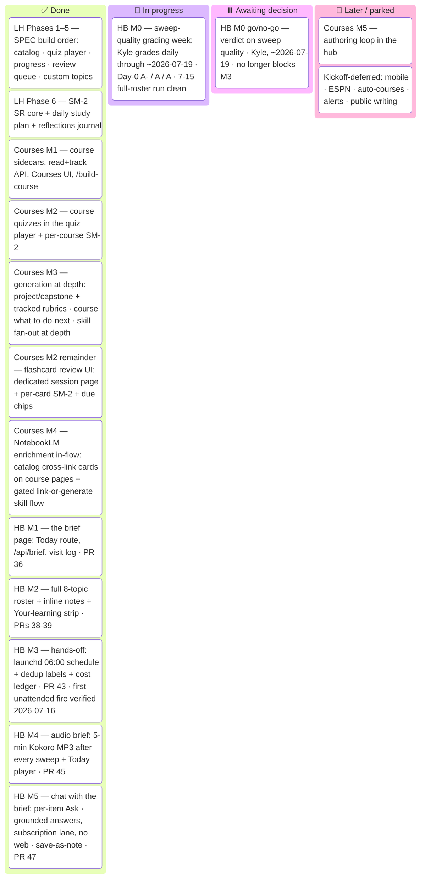

# Master Plan — Home Base

_The **one document** that shows the whole plan and where it stands. The detailed per-phase/
per-milestone plans stay where they are (linked below); this page is the unified progress view
so nobody has to click through a dozen docs to see the state of the project._

> ## 🔄 This is a LIVING document — the maintenance contract
> **Any session that starts, finishes, or reshapes a piece of the plan MUST update this file
> in the same commit/PR as the work**: tick the checkbox, adjust the status column, move the
> card on the Kanban board below, and touch the "Last updated" line. Adding a brand-new
> plan/milestone doc? Add it to the checklist, the board, and the doc map here.
> The rule that enforces this lives in `CLAUDE.md` → "Master plan upkeep".

**Last updated:** 2026-07-17 · Two items shipped on PR #52: **migration ledger hardening** (the BACKLOG item from the 7-16 store repair — `init_db` now trusts the store's actual table shape over the `schema_migrations` ledger, re-running forward migrations idempotently so a poisoned/orphaned ledger row can't silently skip one; poisoned-ledger + unknown-version regression tests) and **habit-metrics instrumentation for the v1 check** (`GET /api/brief/habit` + a self-hiding "Habit check" strip on Today: current week's mornings vs 5 and notes vs 3, plus prior weeks — reads `brief_visits`/`brief_notes`, local Monday-start weeks). Backend 393 passed + 7 skipped, frontend 42 green. The M0 verdict (~07-19) remains the one open item

---

## Where we are, in one paragraph

The repo has two arcs. **Arc 1 — Learning Hub** (the original SPEC build order, Phases 1–5,
plus extension Phases 6–7): **fully shipped**, including the SM-2 spaced-repetition core and
the first three Course-pipeline milestones (M1 read+track · M2 quizzes+SM-2 · M3 generation at
depth — project/capstone + tracked rubrics + a course-level "what to do next"). **Arc 2 — Home Base** (kickoff 2026-07-13: the
morning-brief evolution): **M1, M2, and M3 are shipped** — M3 (hands-off automation, PR #43)
was built 2026-07-15 under Kyle's third deliberate override of the "wait for the M0 verdict"
gate, and its **first unattended 06:00 fire ran clean on 2026-07-16** (8/8 topics, rc=0,
fresh briefs + ledger rows). The kickoff's phased plan (M0–M3) is fully built, and Kyle
picked the encore on 2026-07-16 — **both halves shipped the same day**: **M4 — the audio
brief** (PR #45: a ~5-minute Kokoro-narrated MP3 rendered after every sweep, 🎧 player on
Today) and **M5 — chat with the brief** (PR #47: "Ask about this" on every brief item — one
grounded answer per question on the subscription lane, no web tools, keepers saved as
notes). **M0's sweep-quality grading week continues** alongside (Kyle grades daily through
~2026-07-19); its go/no-go verdict is the one open item.

---

## Kanban

_If the board above doesn't render in your viewer, the checklists below carry the same truth —
the board is a convenience view, the checklists are the record._

---

## Arc 1 — Learning Hub (SPEC build order + extensions) — ✅ COMPLETE

The original product: a NotebookLM learning dashboard (see [`SPEC.md`](../SPEC.md)).
Phases 1–5 were the SPEC build order; 6–7 extended it.

| # | Milestone | Status | Plan doc | Evidence |
|---|-----------|:------:|----------|----------|
| 1 | Catalog + Home + Topic detail (read-only sidecar ingest) | ✅ shipped | [PHASE1_PLAN](PHASE1_PLAN.md) | June 2026 scaffold; parser anti-fabrication guards |
| 2 | In-hub quiz player (offline oracle, answer-key-free sessions) | ✅ shipped | [PHASE2_PLAN](PHASE2_PLAN.md) | `app/quiz/*`, `/api/quiz/*`, QuizPlayer UI |
| 3 | Progress dashboard (trends, streaks, shaky material) | ✅ shipped | [PHASE3_PLAN](PHASE3_PLAN.md) | `store/progress.py`, Progress page w/ inline-SVG sparklines |
| 4 | Mastery decay + "Review next" queue | ✅ shipped | [PHASE4_PLAN](PHASE4_PLAN.md) | `store/mastery.py`, `GET /api/review`, home badges |
| 5 | Custom (non-NotebookLM) topics on home | ✅ shipped | [PHASE5_PLAN](PHASE5_PLAN.md) | `/api/custom-topics` CRUD + "Custom" home section |
| 6 | SM-2 per-item scheduler + daily study plan + reflections journal | ✅ shipped | [PHASE6_PLAN](PHASE6_PLAN.md) | `store/scheduler.py`, `study/planner.py`, `GET /api/study-plan`, Plan page |
| 7 | Courses M1 — course-pipeline vertical slice | ✅ shipped | [PHASE7_PLAN](PHASE7_PLAN.md) | `app/courses/*`, `/api/courses`, Courses UI, `/build-course` |
| 7-M2 | Courses M2 — course quizzes in the player + per-course SM-2 | ✅ shipped | [PHASE7_M2_PLAN](PHASE7_M2_PLAN.md) | `7f2db03`; `course:<slug>` namespace, notebook aggregates filtered |
| 7-M3 | Courses M3 — generation at depth: project/capstone + tracked rubrics · course "what to do next" · skill fan-out at depth | ✅ shipped | [PHASE7_M3_PLAN](PHASE7_M3_PLAN.md) | PR #48; `course_rubric_assessment` (schema v6) · `GET /courses/{slug}/next` · `POST /courses/{slug}/assess` · rubric self-assessment UI |
| 7-M4 | Courses M4 — NotebookLM enrichment in-flow: catalog cross-link on course pages + gated skill flow | ✅ shipped | [PHASE7_M4_PLAN](PHASE7_M4_PLAN.md) | PR #50; `CourseMaterial.notebook` join via `_attach_notebook_refs` · Open-notebook card w/ counts + calm degrades · course-builder §5 two-path flow · **live proof verified 2026-07-16**: `jlens-global-workspace` course (syllabus-gated `/build-course`, `ok:true` zero warnings) links notebook `f84dc873…` via the no-quota path; card resolves against the real catalog |

Also closed in this arc: the **bug-hunt audit** — all 11 low-severity findings resolved
(PRs #21–#31, [`docs/bug-hunt/`](bug-hunt/)).

**Open remainder from the course epic's M2 spec** — ✅ closed 2026-07-16:
- [x] Flashcard **review UI** — ✅ shipped 2026-07-16, PR #49: a dedicated review session at
      `/courses/:slug/flashcards` (due → new → later ordering, again/hard/good grades advancing
      per-card SM-2 in the shared store under `course:<slug>` — no schema change), Review CTAs +
      due chips on Course detail, and due decks ranked into the course "what to do next".
      Addendum in [PHASE7_M2_PLAN](PHASE7_M2_PLAN.md)

---

## Arc 2 — Home Base (morning brief) — 🔄 IN FLIGHT

The current arc: evolve the hub into Kyle's daily home base — self-updating morning brief +
inline notes, learning riding along. Contract: [`KICKOFF-home-base.md`](KICKOFF-home-base.md).

- [ ] 🔄 **M0 — Sweep quality week** ([grades log](M0-sweep-grades.md)) — _the only in-flight item_
  - [x] Sweep engine: per-topic prompts + `make sweep` runner (PR #34)
  - [x] Day-0 source-verified audit: AI **A−** · fantasy **A** · market **A** (PR #35)
  - [x] JSON pipeline refit: prompts emit strict JSON → validated render (with M1, PR #36)
  - [x] First full-roster 8-topic production sweep verified clean, incl. cloud-session run (2026-07-15, PR #40)
  - [ ] **Kyle's daily A–F grades through ~2026-07-19** ← _the live task; pilots gate the verdict_
  - [ ] **Go/no-go verdict** on the 3 pilot topics — Kyle, ~2026-07-19 (kill criteria: persistent misses/slop). _No longer blocks M3, which Kyle chose to build in parallel._
- [x] **M1 — The brief page** — ✅ shipped 2026-07-13, PR #36 ([plan](M1_PLAN.md); deliberate Day-0 override of the M0 gate)
      _Today route at `/` renders stored sweeps · `GET /api/brief` · visit log (habit metric) · old home → "Learning" tab_
- [x] **M2 — Full roster + notes** — ✅ shipped 2026-07-14, PRs #38 + #39 ([plan](M2_PLAN.md); second deliberate override)
      _`sweeps/topics.json` roster (8 topics, pause flags) · read-time item ids · inline notes (`brief_notes` v5, `/notes` page) · "Your learning" strip_
- [x] **M3 — Hands-off** — ✅ shipped 2026-07-15, PR #43 ([plan](M3_PLAN.md); built under the third deliberate override of the M0-verdict gate)
  - [x] Launchd scheduler + wrapper + installer; on-wake catch-up; auth spike + a bounded launchd run proven end-to-end
  - [x] Cost/usage guardrails: `--output-format json` → `data/sweeps/.runs.jsonl` ledger · API-key guard · skip-done · max-topics
  - [x] Read-time dedup: `developing`/`first_seen` labels on repeated stories (nothing dropped) + subtle Today chip
  - [x] Schedule installed 2026-07-15 at 06:00 CT; **first unattended fire verified 2026-07-16** — 8/8 topics, `rc=0` in 25½ min, fresh briefs + 8 ledger rows (~$10 equiv/day, subscription lane — not billed)
- [x] **M4 — Audio brief** — ✅ shipped 2026-07-16, PR #45 ([plan](M4_PLAN.md); picked same day from the post-M3 menu — audio-first over one combined milestone)
      _`sweeps/audio_brief.py`: deterministic ~650-word ear script → local Kokoro (`com.voicemode.kokoro`) → `data/sweeps/<date>/brief.mp3`, best-effort after every sweep (never fails it) · `GET /api/brief/audio` + `audio_available` · 🎧 player on Today · first real render 4:49 across 8 topics_
- [x] **M5 — Chat with the brief** — ✅ shipped 2026-07-16, PR #47 ([plan](M5_PLAN.md); approach A from its own explore-plan — per-item Ask, no web tools)
      _`app/chat.py` (headless `claude -p` on the subscription lane, API key scrubbed, no tools) · `POST /api/brief/chat` · "Ask about this" on every item with save-as-note reuse · `brief-chat.jsonl` ledger under backend data · live e2e: grounded answer in 13s, ~$0.07 equiv_

**v1 success criteria to check ~3 weeks in** (from the kickoff): ≥5 mornings/week habit (visit
log) · significant events reach Kyle here first · foraging → ~zero · ≥3 notes/week attach.
_Instrumented 2026-07-17 (PR #52): `GET /api/brief/habit` + a self-hiding "Habit check" strip on
Today count mornings + notes per local Monday-start week — the two measurable criteria read at a
glance instead of a sqlite dig._

---

## Parked / deferred (not scheduled — do not build without a decision)

- **Course epic M5** ([roadmap](COURSE_PIPELINE_SPEC.md#roadmap-milestones)): the in-hub
  authoring loop (regenerate/edit/reorder from the UI — breaks the read-only-course invariant,
  so it starts with that architectural decision). _(M4 — NotebookLM enrichment — shipped
  2026-07-16; see [PHASE7_M4_PLAN](PHASE7_M4_PLAN.md).)_
- **Kickoff-deferred v1 outs**: mobile access · ESPN league integration · auto-courses from
  news items · breaking-news alerts · public writing. _(The audio brief became M4 and
  chat-with-the-brief became M5 on 2026-07-16.)_
- **BACKLOG parked ideas** ([BACKLOG.md](../BACKLOG.md)): study-planner subagent (superseded by
  Phase 6), learner-profile doc, "Generate from hub" button, hosted phone access.

---

## Doc map (the detailed plans this page summarizes)

| Doc | What it holds |
|---|---|
| [`SPEC.md`](../SPEC.md) | Arc-1 product spec (Learning Hub) |
| [`KICKOFF-home-base.md`](KICKOFF-home-base.md) | Arc-2 contract: brief, scope, risks, milestones |
| [`PHASE1..7_PLAN.md`, `PHASE7_M2_PLAN.md`, `PHASE7_M3_PLAN.md`, `PHASE7_M4_PLAN.md`](.) | Per-phase build plans (Arc 1) |
| [`COURSE_PIPELINE_SPEC.md`](COURSE_PIPELINE_SPEC.md) | Course epic vision + M1–M5 roadmap |
| [`M1_PLAN.md`](M1_PLAN.md) … [`M5_PLAN.md`](M5_PLAN.md) | Home Base milestone plans (record decided design forks — don't relitigate) |
| [`M0-sweep-grades.md`](M0-sweep-grades.md) | The grading week's durable evidence + running verdict |
| [`../BACKLOG.md`](../BACKLOG.md) | Parking lot for uncommitted ideas |
