# Master Plan — Home Base

_The **one document** that shows the whole plan and where it stands. The detailed per-phase/
per-milestone plans stay where they are (linked below); this page is the unified progress view
so nobody has to click through a dozen docs to see the state of the project._

> ## 🔄 This is a LIVING document — the maintenance contract
> **Any session that starts, finishes, or reshapes a piece of the plan MUST update this file
> in the same commit/PR as the work**: tick the checkbox, adjust the status column, move the
> card on the Kanban board below, rewrite the one-line "Last updated" status, and **prepend a
> condensed entry to the [Changelog](#changelog-newest-first)** at the bottom — a dated
> heading + 2–4 lines (what shipped, PR #, key decisions, test counts). Deep detail belongs
> in the PR and the linked docs, not here; never grow the "Last updated" line itself.
> Adding a brand-new plan/milestone doc? Add it to the checklist, the board, and the doc map here.
> The rule that enforces this lives in `CLAUDE.md` → "Master plan upkeep".

**Last updated:** 2026-07-27 · **Visit-source attribution (PR #159)** — the ~08-03 v1 check reads `brief_visits`, and those rows carried no origin, so every localhost dev load, Playwright run, and verify pass of July's build blitz counted as a "morning visit"; the check was on track to certify build exhaust as a reading habit ([idea](ideas/builder-vs-reader-metric.md)). Landed test-first a week ahead of the gate: `app.visit_source` threads FastAPI's `Request` into the visit write and files each load in one coarse bucket (tailnet v4 **and** v6 → `phone` · loopback → `mac-localhost` · the Vite `:5173` origin → `dev`, ahead of the IP · TestClient → `test` · `lan`/`other`/`unknown`), stored in a nullable `source` column at **schema v14**. `mornings_phone` now rides beside `mornings` in `brief_habit_weeks`, the Habit strip, and the Mirror's sentence — **the v1 criterion is deliberately unchanged; both numbers are reported and which one certifies v1 is Kyle's call at the check.** Two honesty gates: July's rows are not back-classified (nullable = unattributed, not zero), and the Mirror omits the phone clause entirely for a window with no attribution rather than fabricating "0 on your phone". Backend +36 · frontend +4. Deployed same-day so attribution accrues real mornings before 08-03. Prior: **Study Scheduler correctness wave (PR #152)** — the eight studycal findings from the 07-26 hunt fixed test-first, ahead of the ~07-29 Google-token expiry that made #2 live. Root cause behind half the cluster: `FakeCalendarPort` always succeeds and hides written events from free/busy, so a mid-batch write failure and a duplicate re-propose were unreachable in tests — a `FlakyCalendarPort` + `feed_back` mode now make them testable. An expired token degrades honestly instead of 500ing behind `connected: true`; every created event is ledgered before the next is created; opt-in is enforced server-side; the parser stops inverting "not Mondays or Fridays" and "9 to 5pm"; placement is curriculum-ordered; a revisit no longer duplicates blocks (schema v13). Backend 739→779. Prior: 2026-07-22 · **Topic↔course cross-links + course quizzes join the daily Plan (this PR)**. The Learning and Courses tabs read as duplicates (the Jacobian topic + its course cover the same paper) and course-quiz mastery decayed silently — course SM-2 rows (written under `course:<slug>`) were filtered out of the study plan. This PR (a) surfaces the already-authored topic↔course link on **both** cards — a topic card gets a `📘 Course →` chip (from a `courses_by_notebook()` reverse index stamped on the catalog), a course card gets a `🎧 Source notebook →` chip (resolved against the sidecar catalog) — and (b) folds course **quizzes** into the cross-notebook `/study-plan` (relaxed `sr_plan_items`' `course:%` filter; course segments titled from the course catalog, badged "Course", routed to `/courses/:slug/quiz`; course flashcards stay on their own surface via a quiz-only filter). `/review` + `/progress` + the home mastery badge stay topic-only. Backend 743→748 · frontend 185→193 · ruff/tsc green. Prior: **M8 Learning Paths fix — build tracks on the AUDIO overviews, not the video (PR #143)**. The live Jacobian-Lens path was quietly built on the notebook's **whiteboard video** season (4 explainer eps: "Anatomy of the Lens" → "Replicating the Paper") mislabeled as `audio` — a hand-authored fixture whose wrong `artifact_id`s bypassed the Designer's catalog cross-check (that check only runs on *generated* paths). Rebuilt around the real **6-episode audio deep-dive season** ("The Global Workspace Idea" → "Consciousness & Replication") as the learning spine; the video series is now supplementary, surfaced only as an optional pointer in the Reflect step. Encoded the convention as **design decision 12** (audio primary, video supplementary — the Designer already enforces it structurally by only arranging audio/study_guide/flashcards/quiz) + a **fixture guard test** (`test_paths_fixture.py`: audio steps must cite audio-series ids · no step may cite a video-series id · artifact_type must match its kind) so a video-as-audio inversion can't recur. Path is now 11 steps (was 9). Backend 741→743 · ruff green; four fixture-count test expectations updated to match. Prior: **Study Scheduler v1.2 — flag calendar conflicts + double-book (PR #142)**. When a requested study window is already booked, the proposal now **flags the conflicting events by name** (titled `port.busy_events` via the primary calendar's `events.list` — the freebusy API has no titles) and offers **"Book over it anyway"** (`allow_double_book` → `plan_sessions(ignore_busy=True)`), with each block that lands on an event badged *"⚠ double-books X"*. For Kyle's shared-calendar case (his girlfriend adds items he can study through). Placement respects busy by default; double-book is an explicit per-proposal opt-in; `busy_events` is best-effort (freebusy still drives placement). Backend 737→741 · frontend 185→186 · ruff/tsc green; **verified live** — his 2–5pm weekday window flags the real conflicts ("Bright Horizons"/"Gearhead") and double-book yields 2 badged blocks. Prior: **Study Scheduler v1.1 — the note box works (PR #141)**. Live-testing v1 exposed that the free-text box did nothing: the `claude -p` lane it depended on can't reach the CLI from the always-on server (`"claude CLI not found"` in the ledger — same PATH class as the #139 nlm fix), and the UI *lied* by showing the untouched default as the answer. Kyle's call: a **local deterministic parser** (`app.studycal.parse`, no LLM) is now the note box's primary engine — days/exclusions · time-of-day · session length · max blocks, refining the current controls; the note **refines** them (note wins for keys it names) and only a phrasing the parser can't read falls back to `claude -p` (symlinked onto the server PATH); if neither reads it, the plan is left unchanged with an **honest** message. Default window aligned to a daytime 9am–5pm. Backend 723→737 (+parser suite, +refine/fallback/honesty API tests) · frontend 185 green · ruff/tsc green. His exact note ("sixty-minute blocks every weekday, no earlier than 2pm, no later than 5pm") now yields weekdays · 2–5pm · 60-min. Prior: **Study Scheduler v1 — flexible, preference-honoring scheduling (PR #140)**, on top of v0 (PR #137/#138). v0 ignored the two things a learner asks for most — *which days* and *what time of day*: there was no day-of-week concept anywhere, and the evening-only window silently rewrote "before 2pm" into a 6–7pm slot. v1: a real **`days_of_week`** planner knob (Mon=0…Sun=6) · explicit panel controls (day chips · time range · session length · max blocks) that drive the plan **deterministically** · the `claude -p` lane taught the new knob + worked "before 2pm"/"weekdays" examples and now *drives the controls* (each propose echoes an `applied` plan the UI snaps to; note-turns accumulate via the persisted base) · **per-key hand-vs-LLM precedence** · **schema v12** persists the prefs per-track so "weekdays before 2pm" sticks across visits + devices. Backend 709→723 · frontend 180→185 · ruff/tsc/build green; the v12 migration verified to heal a pre-v12 store. A **live** write still needs Kyle's one-time OAuth ([`STUDY_SCHEDULER.md`](STUDY_SCHEDULER.md)); until then it degrades honestly to a "connect your calendar" state. New package `app.studycal` (distinct from the SM-2 `app.study`/`store.scheduler`). Prior: **M8 — Learning Paths, the Jacobian-Lens vertical slice ✅ CLOSED (PR #136)** — the #15 green gate closed the whole slice end to end — design (#126) → Phases 1–4 (#127–129) → Designer (#130) → Plan Continue lane (#132) → Designer curation (#134) → three-trend Progress (#135) → green gate (#136). Live path quality was judged good 2026-07-22; **the slice is now live on the prod hub** — advanced from a stale ee904c9 → origin/main, frontend rebuilt, `com.homebase.server` kickstarted (health ok; `/api/paths` now carries `confidence`). **Moonshot queue: EMPTY.** Next M8 = scale the Designer beyond the one bundled fixture to the rest of the library (future). Also open: M6 phone trio (Kyle) · ~08-03 v1 check · ~08-19 re-grade · PR10 only-if-wobble. _Full history: [Changelog](#changelog-newest-first)._

---

## Where we are, in one paragraph

The repo has two arcs. **Arc 1 — Learning Hub** (the original SPEC build order, Phases 1–5,
plus extension Phases 6–7): **fully shipped**, including the SM-2 spaced-repetition core and
the **complete five-milestone Course pipeline** (M1 read+track · M2 quizzes+SM-2 · M3
generation at depth · M4 NotebookLM enrichment · M5 in-hub authoring loop, shipped 2026-07-19
— the epic's last line). **Arc 2 — Home Base** (kickoff 2026-07-13: the
morning-brief evolution): **M1, M2, and M3 are shipped** — M3 (hands-off automation, PR #43)
was built 2026-07-15 under Kyle's third deliberate override of the "wait for the M0 verdict"
gate, and its **first unattended 06:00 fire ran clean on 2026-07-16** (8/8 topics, rc=0,
fresh briefs + ledger rows). The kickoff's phased plan (M0–M3) is fully built, and Kyle
picked the encore on 2026-07-16 — **both halves shipped the same day**: **M4 — the audio
brief** (PR #45: a ~5-minute Kokoro-narrated MP3 rendered after every sweep, 🎧 player on
Today) and **M5 — chat with the brief** (PR #47: "Ask about this" on every brief item — one
grounded answer per question on the subscription lane, no web tools, keepers saved as
notes). **M0's sweep-quality grading week closed 2026-07-19 with a PASS verdict** (zero
fabricated items all week; one prompt tune to the AI sweep) — the Home Base kickoff plan
(M0–M3) plus its four encores (M4–M7) are now fully built *and* fully gated. The open
items are M6's phone-side eyes-on evidence (Kyle) and the ~08-03 v1 success-criteria check.

---

## Kanban

```mermaid
---
config:
  kanban:
    sectionWidth: 300
---
kanban
  done["✅ Done"]
    lh15["LH Phases 1–5 — SPEC<br/>build order: catalog ·<br/>quiz player · progress<br/>· review queue ·<br/>custom topics"]
    lh6["LH Phase 6 — SM-2 SR<br/>core + daily study<br/>plan + reflections<br/>journal"]
    lh7["Courses M1 — course<br/>sidecars, read+track<br/>API, Courses UI,<br/>/build-course"]
    lh7m2["Courses M2 — course<br/>quizzes in the quiz<br/>player + per-course<br/>SM-2"]
    lh7m3["Courses M3 —<br/>generation at depth:<br/>project/capstone +<br/>tracked rubrics ·<br/>course what-to-do-next<br/>· skill fan-out at<br/>depth"]
    lh7fc["Courses M2 remainder —<br/>flashcard review UI:<br/>dedicated session page<br/>+ per-card SM-2 + due<br/>chips"]
    lh7m4["Courses M4 —<br/>NotebookLM enrichment<br/>in-flow: catalog<br/>cross-link cards on<br/>course pages + gated<br/>link-or-generate skill<br/>flow"]
    hbm1["HB M1 — the brief<br/>page: Today route,<br/>/api/brief, visit log<br/>· PR 36"]
    hbm2["HB M2 — full 8-topic<br/>roster + inline notes<br/>+ Your-learning strip<br/>· PRs 38-39"]
    hbm3["HB M3 — hands-off:<br/>launchd 06:00 schedule<br/>+ dedup labels + cost<br/>ledger · PR 43 · first<br/>unattended fire<br/>verified 2026-07-16"]
    hbm4["HB M4 — audio brief:<br/>5-min Kokoro MP3 after<br/>every sweep + Today<br/>player · PR 45"]
    hbm5["HB M5 — chat with the<br/>brief: per-item Ask ·<br/>grounded answers,<br/>subscription lane, no<br/>web · save-as-note ·<br/>PR 47"]
    hbm6["HB M6 — mobile:<br/>one-port serve +<br/>LaunchAgent · sw.js v2<br/>cached last brief ·<br/>bottom tab bar +<br/>Today/Notes pass · PRs<br/>55-56 · Mac-side live<br/>verify clean 07-18,<br/>phone proof pending<br/>Kyle"]
    hbm7["HB M7 — news mode: RSS<br/>category shell ·<br/>news_events signal log<br/>+ card feedback · For<br/>You decaying-profile<br/>ranker w/ search-feed<br/>reach · topic scout →<br/>one-click roster adds<br/>· PRs 58/60/62/63 +<br/>polish 65-67 · live<br/>e2e proof clean 07-18"]
    hbm0["HB M0 — sweep-quality<br/>week: CLOSED 07-19,<br/>verdict PASS · zero<br/>fabrications all week<br/>· AI sweep prompt<br/>tuned · grades + audit<br/>in M0-sweep-grades.md"]
    cm5["Courses M5 — authoring<br/>loop in the hub:<br/>objectives editor ·<br/>reorder w/ id pinning<br/>· regenerate on the<br/>claude lane w/<br/>validate-or-rollback ·<br/>zip export · epic<br/>complete 07-19"]
    bugp1["Bug fixes P1 — all 5<br/>medium 07-19 hunt<br/>findings fixed 07-19,<br/>one PR each,<br/>test-first:<br/>blank-brief PR 73 ·<br/>promptless scout add<br/>PR 74 · frozen news<br/>category PR 75 · UTC<br/>streak days PR 76 ·<br/>dev-vs-prod port clash<br/>PR 77"]
    qu5["Wave 1 QU5 — notes on<br/>News/For-You cards:<br/>Note button →<br/>existing POST<br/>/brief/notes, origin<br/>slug credited,<br/>interleaves on /notes<br/>· PR 84"]
    wave1["Wave 1 — trust +<br/>liveness COMPLETE<br/>07-19: didnt-run<br/>banner QU12 PR 82 ·<br/>trust gauge PR5 PR 83<br/>· notes on News QU5 PR<br/>84 · heartbeat PR12 PR<br/>85 + Mac install"]
    w2b1["W2 batch 1 —<br/>sweep/brief pipeline:<br/>unreadable-file 500 #7<br/>· query-string dedup<br/>#6 · atomic render<br/>staging #22 ·<br/>RunAtLoad #19 ·<br/>re-sweep note guard<br/>HA2 · PR 87"]
    w2b2["W2 batch 2 — LLM-lane<br/>containment: full<br/>env-scrub set #10 ·<br/>tools-off + scratch<br/>cwd #23 · untrusted<br/>framing HA4 · PR 89"]
    w2b3["W2 batch 3 — news<br/>resilience:<br/>parsed-empty cache<br/>guard HA8 · roster<br/>write lock #12 ·<br/>local-day scout gate<br/>#13 · PR 90"]
    w2b4["W2 batch 4 — offline<br/>honesty: audio-date<br/>pairing + player hide<br/>#15 · offline delete<br/>#16 · per-request dist<br/>#8 · PR 91"]
    w2b5["W2 batch 5 — store<br/>safety: pre-migration<br/>snapshot HA11 ·<br/>bad-row-proof streaks<br/>#9 · PR 92"]
    w2b6["W2 batch 6 — notes<br/>UX: undo toast FR10<br/>(3 destructive taps) ·<br/>filter fallback #14 ·<br/>honest delete error<br/>#17 · PR 93"]
    wave2["Wave 2 — correctness<br/>sweep COMPLETE 07-19:<br/>6 test-first batches<br/>PRs 87 89 90 91 92 93<br/>· 14 low bugs + 4<br/>hardens + FR10 closed"]
    wave3["Wave 3 — walk and<br/>phone COMPLETE 07-20:<br/>QU3 resume PR 95 ·<br/>QU4 chips PR 96 ·<br/>FR15 nav survival PR<br/>97 · FR4 chapters PR<br/>98 · FR13 what<br/>changed PR 99 · FR2<br/>phone sweep PR 100 ·<br/>QU1 archive PR 101"]
    w4courses["W4 courses batch —<br/>fence-strip guard #11<br/>· crash-safe writer<br/>#18 · stale-load token<br/>#20 · order-only<br/>revert #21 · PR 103 ·<br/>sixth gate override"]
    w4mirror["W4 moonshot — Mirror<br/>v0 'You this week'<br/>strip: read-time over<br/>4 signal exhausts ·<br/>honest cold start ·<br/>zero LLM zero writes<br/>· PR 104 · seventh<br/>gate override"]
    w4readiness["W4 moonshot #2 —<br/>Readiness v0 'Coming<br/>up' strip:<br/>trajectories-only<br/>forward projection ·<br/>badge-identical keys ·<br/>honest cold start ·<br/>PR 105 · eighth gate<br/>override"]
    w4calibrated["W4 moonshot #3 —<br/>Calibrated Doubt v0<br/>'Yesterday's calls':<br/>optional wagers in all<br/>prompts · frozen-file<br/>normalize pass-through<br/>· zero-LLM next-sweep<br/>grading ·<br/>calibration.jsonl ·<br/>trial-week label · PR<br/>106 · ninth gate<br/>override"]
    m8["HB M8 — learning paths<br/>(AI study-designer over<br/>NotebookLM topics):<br/>Ph1-2 loader + coverage/<br/>confidence stores (v10) +<br/>Jacobian fixture · PR 127<br/>· Ph3 Paths API (3 axes +<br/>bridge grader) · PR 128 ·<br/>Ph4 frontend — PathPlayer<br/>+ 3-axis card · PR 129 ·<br/>Designer — on-demand<br/>Generate, M0-validated<br/>claude -p · PR 130 ·<br/>Plan Continue lane · PR<br/>132 · Progress 3 axes<br/>(Option B) · PR 135 ·<br/>green gate · PR 136 ·<br/>slice CLOSED"]
    hbss["HB Study Scheduler v0→v1<br/>— opt-in Calendar study<br/>blocks for a path:<br/>schema v11 opt-in +<br/>removable ledger ·<br/>per-kind durations ·<br/>deterministic CT/DST<br/>planner · CalendarPort<br/>+ Fake/Google · claude<br/>-p negotiation lane ·<br/>PathPlayer panel · PR<br/>#137/#138 · v1 flexible<br/>prefs: days_of_week knob<br/>+ panel controls +<br/>applied-echo + schema<br/>v12 persistence · v1.3<br/>correctness wave — 8<br/>bugs, honest token<br/>degrade + per-event<br/>ledger + ordered<br/>placement (v13) · PR<br/>#152 · live write<br/>pending Kyle OAuth"]
  doing["🔄 In progress"]
    hbm6proof["HB M6 remainder —<br/>phone eyes-on<br/>evidence: home-screen<br/>standalone ·<br/>airplane-mode banner ·<br/>iOS audio scrub ·<br/>reboot survival · Kyle"]
  next["📋 Planned"]
    hbm8["HB M8 — scale beyond<br/>the slice (future):<br/>the Jacobian-Lens<br/>vertical slice shipped<br/>+ quality judged good<br/>07-22 · next = run the<br/>Designer across the<br/>rest of the library +<br/>batch-overnight paths"]
    rep0726["Replenish 2026-07-26 —<br/>remainder: 10 of 24<br/>bugs unfixed (8 studycal<br/>in PR #152 · the audio/<br/>archive 6 in PR #153) +<br/>16 ideas (4 Moonshot ·<br/>5 QuickWin · 2 Premortem<br/>· 3 Harden · 2 Friction)<br/>· #1 and #3 are the<br/>highest-value remaining<br/>· awaiting wave<br/>sequencing via<br/>/backlog-hygiene"]
  decide["⏸️ Awaiting decision"]
  later["🧊 Later / parked"]
    wave4["Wave 4 remainder —<br/>moonshot queue EMPTY<br/>(all four built; Overnight<br/>v0 PR #107 closed it) ·<br/>Overnight send gate =<br/>per-errand-type graded<br/>record + conversation,<br/>later · vault feed PR10<br/>only if habit wobbles"]
    defer["Kickoff-deferred: ESPN<br/>· auto-courses ·<br/>alerts · public<br/>writing"]
```

_If the board above doesn't render in your viewer, the checklists below carry the same truth —
the board is a convenience view, the checklists are the record._

---

## Roadmap — replenish wave order (locked 2026-07-19)

_Prioritization session 2026-07-19: the replenish backlog (21 ideas + 18 low bugs) sequenced
into four waves. Organizing principle: everything that protects the ~08-03 v1 criteria
(≥5 mornings/week · events reach Kyle here first · ≥3 notes/week) ships before the check;
the big bets wait for its verdict. Ids are brainstorm-lane ids (QU/PR/HA/FR = QuickWin /
Premortem / Harden / Friction), **not** pull-request numbers; `BACKLOG.md ## Open` stays the
item-level record, with a vision doc per idea in [`ideas/`](ideas/)._

1. **Wave 1 — trust + liveness + notes funnel** — ✅ **COMPLETE 2026-07-19**: QU12 didn't-run
   banner (PR #82) → PR5 sweep-trust gauge (PR #83) → QU5 notes-on-News (PR #84) → PR12
   heartbeat (PR #85; Mac install + live verify done same session — healthy path read the
   real ledger, forced-stale run proved both alert channels; evidence in the Last-updated
   entry).
2. **Wave 2 — correctness sweep** — ✅ **COMPLETE 2026-07-19** (6 test-first batches,
   PRs #87 · #89 · #90 · #91 · #92 · #93; backend 524 → 555, frontend 76 → 86): the 14
   non-courses bug lows + the 4 hardens + FR10 (the 4
   courses lows #11/#18/#20/#21 are Wave 4's batch), batched into 6
   test-first subsystem PRs — sweep/brief pipeline (#7 #22 #19 #6 + HA2 re-sweep warn) ·
   LLM-lane containment (HA4 untrusted framing + #23 tools/cwd + #10 env-scrub set) · news
   resilience (HA8 + #12 + #13) · offline/PWA honesty (#15 #16 #8) · store safety (HA11
   pre-migration snapshot + #9) · notes UX (FR10 undo toast + #14 + #17).
   **Batch 1 (sweep/brief pipeline) ✅ shipped 2026-07-19, PR #87**: #7 unreadable-file
   500 · #22 atomic render staging (renderer stays frozen) · #19 RunAtLoad (reinstalled
   + live-verified same session: on-load fire = 8/8 SKIP_DONE no-op, rc=0) · #6
   query-string dedup identity · HA2 re-sweep note guard.
   **Batch 2 (LLM-lane containment) ✅ shipped 2026-07-19, PR #89**: #10 full env-scrub
   set (both claude lanes + the launchd wrapper) · #23 `--tools ""` + empty scratch cwd
   (both lanes) · HA4 untrusted-data framing in both build_prompts.
   **Batch 3 (news resilience) ✅ shipped 2026-07-19, PR #90**: HA8 parsed-empty cache
   guard (serve stale, never clobber) · #12 roster write lock + unique tempfile · #13
   scout persistence gate on America/Chicago days.
   **Batch 4 (offline/PWA honesty) ✅ shipped 2026-07-19, PR #91**: #15 sw.js audio-date
   pairing + error-driven player hide · #16 offline disables the per-note delete · #8
   per-request dist check (make build needs no restart).
   **Batch 5 (store safety) ✅ shipped 2026-07-19, PR #92**: HA11 unconditional
   pre-migration snapshot (newest 5 kept; failing-migration restorability proven) · #9
   bad-row-proof streak parsing.
   **Batch 6 (notes UX) ✅ shipped 2026-07-19, PR #93**: FR10 shared undo toast over
   all three destructive taps (Undo = zero API mutation) · #14 filter fallback · #17
   honest delete-error banner. **Wave closed.**
3. **Wave 3 — walk & phone experience** — ✅ **COMPLETE 2026-07-20** (7 items, one
   test-first PR each, all in one day: PRs #95 · #96 · #97 · #98 · #99 · #100 · #101;
   backend 555 → 574, frontend 86 → 104): QU3 audio
   resume → QU4 topic chips → FR15
   Today-survives-navigation → FR4 audio chapters → FR13 developing "what changed" → FR2
   sweep-from-the-phone → QU1 yesterday's brief. (QU3/FR15/FR4 all touch the audio player —
   the FR15 structural hoist lands before the things that build on it.)
   **QU3 audio resume ✅ shipped 2026-07-20, PR #95**: localStorage position memory on the
   M4 player — timeupdate saves keyed by brief date · loadedmetadata restores before first
   play · ended clears (open question decided: a finished brief starts fresh). Handlers on
   the element itself so the FR15 hoist carries them. Frontend 86 → 89.
   **QU4 topic chips ✅ shipped 2026-07-20, PR #96**: id={slug} + scroll-mt anchors on every
   TopicSection, sticky chip row under the app header scrollIntoView-ing each — every served
   topic gets a chip (no dimming), row hides for a single topic, horizontal scroll over wrap.
   Frontend 89 → 91.
   **FR15 Today-survives-navigation ✅ shipped 2026-07-20, PR #97**: BriefShell above
   <Routes> holds the brief payload (stale-while-revalidate, instant same-commit returns)
   + the single audio element (stable-host portal, never remounted, keeps playing on
   News/Notes). #15 + QU3 handlers moved verbatim; scroll memory deferred. Frontend 91 → 93.
   **FR4 audio chapters ✅ shipped 2026-07-20, PR #98**: build_script's own word math →
   brief.chapters.json (written pre-render, atomic; API serves audio_chapters only beside
   a real mp3, degrading to [] on any file problem); chips seek start−2s so the spoken
   "Next up:" confirms the jump. Backend 555 → 562, frontend 93 → 95.
   **FR13 developing "what changed" ✅ shipped 2026-07-20, PR #99**: developing items carry
   prior_digest (first_seen day's digest, same identity keys as the badge); chat threads it
   as a delimited PRIOR VERSION block; the badge toggles the verbatim "As written" reveal.
   Deterministic bytes from disk — zero new LLM surface. Backend 562 → 567, frontend 95 → 97.
   **FR2 sweep-from-the-phone ✅ shipped 2026-07-20, PR #100**: POST /brief/sweep spawns the
   same ./sweep.sh detached behind an in-process lock (honest already_running; 503 on a
   missing runner; scrubbed env + SKIP_DONE, never FORCE — HA2 holds); stale banner gains
   Refresh now + a 30s poll. Deliberate assumption-2 crossing, guard-first.
   Backend 567 → 571, frontend 97 → 100.
   **QU1 yesterday's brief ✅ shipped 2026-07-20, PR #101**: ?date= serves any renderable
   archived day (notes joined, honest 404s, prev/next neighbors; audio was latest-only here
   — PR #153 opened it to any day that kept its mp3);
   sw.js stands aside for ?date= (clobber pin); /brief/:date BriefArchive page outside
   the FR15 shell (notes live, Ask hidden, no stale nag); /notes dates are Links.
   Backend 571 → 574, frontend 100 → 104. **Wave closed.**
4. **Wave 4 — post-08-03 decision points**: the moonshot pick — **DECIDED, Mirror v0
   ✅ shipped 2026-07-20, PR #104** (Kyle's pick, built on his explicit go — the seventh
   deliberate gate override: deterministic 'You this week' strip on Today over the four
   existing signal exhausts, honest cold start, zero LLM/zero writes; the strip doubles as
   the ~08-03 check's own instrumentation; backend 580 → 587, frontend 106 → 109).
   **Kyle's decision 2026-07-20: all four moonshots will eventually be built, one at a
   time.** **Readiness v0 ✅ shipped 2026-07-20, PR #105** (Kyle's next pick, same-day, on
   his explicit go — the eighth deliberate gate override: trajectories-only 'Coming up'
   strip on the live Today, projected from the developing badge's own prior-day walk with
   identical identity keys, honest below two archived mornings, zero LLM/zero writes; the
   calendar/vault collision join stays the unscoped flagship; backend 587 → 595, frontend
   109 → 113). **Calibrated Doubt v0 ✅ shipped 2026-07-20, PR #106** (Kyle's third pick,
   same-day, on his explicit go — the ninth deliberate gate override, with the narrow
   render_brief.py unfreeze granted: optional wager fields in all 8 prompts + scout
   template, normalize()-only pass-through in the frozen file, zero-LLM
   next-readable-sweep grading on the badge's own identity keys with
   open-on-pipeline-failure honesty, append-once calibration.jsonl, 🎯 'Yesterday's
   calls' strip + open-wager chips, trial-week label until 7 graded mornings — the
   ~08-19 re-grade doubles as its M0-style graded week; backend 595 → 611, frontend
   113 → 119). **Overnight Chief of Staff v0 ✅ shipped 2026-07-20, PR #107** (the LAST
   moonshot, built on Kyle's explicit go at its standing gate conversation — the tenth
   deliberate gate override. The gate's three open questions were answered before any
   code and are the recorded scope: (1) **in-repo data only** — the vault bridge
   (draft-follow-up/gmail-triage/app-sync/finance-review) waits behind its own later
   gate; (2) **draft-only v0, graded send gate later** — each errand TYPE earns
   send/execute only via its own M0-style graded record + gate conversation, nothing
   unlocks by default; (3) **undo = discard + the reversibility rule** — only genuinely
   reversible actions are ever eligible for the send gate, irreversible ones stay
   draft-only permanently. Build: nightly actions_queue.py pass on the M5 lane →
   overnight.jsonl → live-only 🌙 approve/discard queue, approve = a real note via the
   existing notes path; backend 611 → 625, frontend 119 → 126). **The moonshot queue is
   EMPTY — all four decided moonshots are built.**
   · PR10 feed-the-vault **only if** the habit check wobbles (it is the
   antibody for exactly that failure) · courses correctness batch (#11 #18 #20 #21) in one PR
   — **✅ shipped 2026-07-20, PR #103** (the wave's one pre-decided build, pulled ahead of the
   check on Kyle's call — the sixth deliberate gate override; backend 574 → 580, frontend
   104 → 106).

Waves 1–3 are roughly two weeks at normal cadence, landing at the ~08-03 checkpoint.

---

## Arc 1 — Learning Hub (SPEC build order + extensions) — ✅ COMPLETE

The original product: a NotebookLM learning dashboard (see [`SPEC.md`](../SPEC.md)).
Phases 1–5 were the SPEC build order; 6–7 extended it.

| # | Milestone | Status | Plan doc | Evidence |
|---|-----------|:------:|----------|----------|
| 1 | Catalog + Home + Topic detail (read-only sidecar ingest) | ✅ shipped | [PHASE1_PLAN](PHASE1_PLAN.md) | June 2026 scaffold; parser anti-fabrication guards |
| 2 | In-hub quiz player (offline oracle, answer-key-free sessions) | ✅ shipped | [PHASE2_PLAN](PHASE2_PLAN.md) | `app/quiz/*`, `/api/quiz/*`, QuizPlayer UI |
| 3 | Progress dashboard (trends, streaks, shaky material) | ✅ shipped | [PHASE3_PLAN](PHASE3_PLAN.md) | `store/progress.py`, Progress page w/ inline-SVG sparklines |
| 4 | Mastery decay + "Review next" queue | ✅ shipped | [PHASE4_PLAN](PHASE4_PLAN.md) | `store/mastery.py`, `GET /api/review`, home badges |
| 5 | Custom (non-NotebookLM) topics on home | ✅ shipped | [PHASE5_PLAN](PHASE5_PLAN.md) | `/api/custom-topics` CRUD + "Custom" home section |
| 6 | SM-2 per-item scheduler + daily study plan + reflections journal | ✅ shipped | [PHASE6_PLAN](PHASE6_PLAN.md) | `store/scheduler.py`, `study/planner.py`, `GET /api/study-plan`, Plan page |
| 7 | Courses M1 — course-pipeline vertical slice | ✅ shipped | [PHASE7_PLAN](PHASE7_PLAN.md) | `app/courses/*`, `/api/courses`, Courses UI, `/build-course` |
| 7-M2 | Courses M2 — course quizzes in the player + per-course SM-2 | ✅ shipped | [PHASE7_M2_PLAN](PHASE7_M2_PLAN.md) | `7f2db03`; `course:<slug>` namespace, notebook aggregates filtered |
| 7-M3 | Courses M3 — generation at depth: project/capstone + tracked rubrics · course "what to do next" · skill fan-out at depth | ✅ shipped | [PHASE7_M3_PLAN](PHASE7_M3_PLAN.md) | PR #48; `course_rubric_assessment` (schema v6) · `GET /courses/{slug}/next` · `POST /courses/{slug}/assess` · rubric self-assessment UI |
| 7-M4 | Courses M4 — NotebookLM enrichment in-flow: catalog cross-link on course pages + gated skill flow | ✅ shipped | [PHASE7_M4_PLAN](PHASE7_M4_PLAN.md) | PR #50; `CourseMaterial.notebook` join via `_attach_notebook_refs` · Open-notebook card w/ counts + calm degrades · course-builder §5 two-path flow · **live proof verified 2026-07-16**: `jlens-global-workspace` course (syllabus-gated `/build-course`, `ok:true` zero warnings) links notebook `f84dc873…` via the no-quota path; card resolves against the real catalog |
| 7-M5 | Courses M5 — the authoring loop in the hub: edit objectives · reorder · regenerate · export (the epic's last line) | ✅ shipped | [PHASE7_M5_PLAN](PHASE7_M5_PLAN.md) | PR #69; `courses/writer.py` = the one transactional write path (CLI delegates; write→validate→byte-identical rollback; bundled examples 409/`editable:false`) · `PUT …/objectives` + `PUT …/order` (complete bijection, `pin_ids` oracle-tested against the loader) · `POST …/regenerate` on the chat.py lane (key scrubbed, no tools, per-type contracts, `course-regen.jsonl`) · `GET …/export` zip · edit-mode UI w/ stats-reset warning · 493 backend + 66 frontend tests |

Also closed in this arc: the **bug-hunt audit** — all 11 low-severity findings resolved
(PRs #21–#31, [`docs/bug-hunt/`](bug-hunt/)).

**Open remainder from the course epic's M2 spec** — ✅ closed 2026-07-16:
- [x] Flashcard **review UI** — ✅ shipped 2026-07-16, PR #49: a dedicated review session at
      `/courses/:slug/flashcards` (due → new → later ordering, again/hard/good grades advancing
      per-card SM-2 in the shared store under `course:<slug>` — no schema change), Review CTAs +
      due chips on Course detail, and due decks ranked into the course "what to do next".
      Addendum in [PHASE7_M2_PLAN](PHASE7_M2_PLAN.md)

---

## Arc 2 — Home Base (morning brief) — 🔄 IN FLIGHT

The current arc: evolve the hub into Kyle's daily home base — self-updating morning brief +
inline notes, learning riding along. Contract: [`KICKOFF-home-base.md`](KICKOFF-home-base.md).

- [x] **M0 — Sweep quality week** — ✅ **CLOSED 2026-07-19, verdict PASS** ([grades + audit](M0-sweep-grades.md))
  - [x] Sweep engine: per-topic prompts + `make sweep` runner (PR #34)
  - [x] Day-0 source-verified audit: AI **A−** · fantasy **A** · market **A** (PR #35)
  - [x] JSON pipeline refit: prompts emit strict JSON → validated render (with M1, PR #36)
  - [x] First full-roster 8-topic production sweep verified clean, incl. cloud-session run (2026-07-15, PR #40)
  - [x] Daily A–F grades through 07-18: Kyle's 07-15 blanket B+ · source-verified 07-16→18 audit (~30 cross-searches, zero fabrications), grades adopted by Kyle 07-19
  - [x] **Go/no-go verdict — PASS, 2026-07-19**: market outstanding · fantasy strong · AI passes **with a prompt tune** (`sweeps/prompts/ai-llms.md`: exclusion carries the same sourcing bar as inclusion, after the mishandled Gemini-delay thread). Kill criteria not met.
- [x] **M1 — The brief page** — ✅ shipped 2026-07-13, PR #36 ([plan](M1_PLAN.md); deliberate Day-0 override of the M0 gate)
      _Today route at `/` renders stored sweeps · `GET /api/brief` · visit log (habit metric) · old home → "Learning" tab_
- [x] **M2 — Full roster + notes** — ✅ shipped 2026-07-14, PRs #38 + #39 ([plan](M2_PLAN.md); second deliberate override)
      _`sweeps/topics.json` roster (8 topics, pause flags) · read-time item ids · inline notes (`brief_notes` v5, `/notes` page) · "Your learning" strip_
- [x] **M3 — Hands-off** — ✅ shipped 2026-07-15, PR #43 ([plan](M3_PLAN.md); built under the third deliberate override of the M0-verdict gate)
  - [x] Launchd scheduler + wrapper + installer; on-wake catch-up; auth spike + a bounded launchd run proven end-to-end
  - [x] Cost/usage guardrails: `--output-format json` → `data/sweeps/.runs.jsonl` ledger · API-key guard · skip-done · max-topics
  - [x] Read-time dedup: `developing`/`first_seen` labels on repeated stories (nothing dropped) + subtle Today chip
  - [x] Schedule installed 2026-07-15 at 06:00 CT; **first unattended fire verified 2026-07-16** — 8/8 topics, `rc=0` in 25½ min, fresh briefs + 8 ledger rows (~$10 equiv/day, subscription lane — not billed)
- [x] **M4 — Audio brief** — ✅ shipped 2026-07-16, PR #45 ([plan](M4_PLAN.md); picked same day from the post-M3 menu — audio-first over one combined milestone)
      _`sweeps/audio_brief.py`: deterministic ~650-word ear script → local Kokoro (`com.voicemode.kokoro`) → `data/sweeps/<date>/brief.mp3`, best-effort after every sweep (never fails it) · `GET /api/brief/audio` + `audio_available` · 🎧 player on Today · first real render 4:49 across 8 topics_
- [x] **M5 — Chat with the brief** — ✅ shipped 2026-07-16, PR #47 ([plan](M5_PLAN.md); approach A from its own explore-plan — per-item Ask, no web tools)
      _`app/chat.py` (headless `claude -p` on the subscription lane, API key scrubbed, no tools) · `POST /api/brief/chat` · "Ask about this" on every item with save-as-note reuse · `brief-chat.jsonl` ledger under backend data · live e2e: grounded answer in 13s, ~$0.07 equiv_
- [x] **M6 — Mobile** — ✅ shipped 2026-07-18, PRs #55 + #56 ([plan](M6_PLAN.md); promoted from the kickoff-deferred list, the M4/M5 path; fourth deliberate override of the M0-verdict gate — zero new prompt surface)
      _One-port serving backbone (FastAPI serves `frontend/dist`, `/api` always wins) + `com.homebase.server` KeepAlive LaunchAgent (printed pmset, never sudo) · sw.js v2 cached-last-brief offline w/ `X-Served-From-Cache` honesty (writes never queue) · bottom tab bar &lt;sm + Today/Notes phone pass (desktop untouched) · Mac-side live verify clean 2026-07-18 incl. audio Range 206 · **real-iPhone reach verified 2026-07-18 (PR #64)** — ts.net load from the phone's tailnet IP, SW registered, first phone visit logged · remaining: Kyle's eyes-on trio (home-screen standalone · airplane-mode banner · iOS audio scrub) + reboot survival_

- [x] **M7 — News mode** — ✅ shipped 2026-07-18, all four phases: PRs #58 · #60 · #62 · #63 ([plan](M7_PLAN.md); approved by Kyle from a recon-backed interview — RSS sourcing · Local = Chicago/Lake Co. · behavior-only For You signals; fifth deliberate M0-gate override, zero new LLM surface)
  - [x] Phase 1 — RSS shell: `sweeps/news_categories.json` roster · `app/news.py` (stdlib fetch/parse, sha1-link ids) · `news_feed_cache` (schema v7, 15-min TTL, stale-honesty) · `GET /api/news/*` · `/news` page w/ category tabs + text-first cards · 13 backend + 5 page tests
  - [x] Phase 2 — signals ✅ 2026-07-18: `news_events` (schema v8, snapshot columns) + `POST /api/news/events` (invalid events 400) + visit/click logging + More-like-this / Not-interested card buttons, all fire-and-forget
  - [x] Phase 3 — For You ✅ 2026-07-18: `app/foryou.py` decaying profile (click +3 · more_like +5 · not_interested −8 · visit +1, 14-day half-life) → all sections + per-term search RSS candidates → interest × freshness ranking w/ seen-exclusion, negative-drop, headline dedup · `GET /api/news/foryou` · default For You tab w/ origin chips + honest cold start
  - [x] Phase 4 — topic scout ✅ 2026-07-18: `suggest_topics` (score ≥ 9 across ≥ 3 days · event-level roster coverage · token-disjoint one-card-per-theme · theme-wide dismiss memory, schema v9) → evidence cards in For You → `POST /api/news/suggestions/add` appends atomically to `sweeps/topics.json` (409 on dupe; the one deliberate Mode-B → Mode-A write) · live e2e proof clean
  - [x] Post-ship polish ✅ 2026-07-18: **PR #65** News promoted into the mobile bottom tab bar · **PR #66** Uplifting category (good-news feeds + attribution fallback) · **PR #67** near-duplicate headline collapse on category pages (newest copy wins)

- [x] **M8 — Learning paths** — ✅ VERTICAL SLICE SHIPPED 2026-07-22 (#126–#136; live on the prod hub); scaling the Designer beyond the bundled fixture is future work. ([design](ideas/learning-paths.md); approved 2026-07-21 brainstorm → `/explore-plan` approach A: a fixture-first vertical slice that turns Learning from a flat grid with a dead "mastery —" chip into an AI study-designer over your NotebookLM topics, scored on three honest axes — coverage · SM-2 recall · self-rated confidence)
  - [x] Phases 1–2 — `app.paths` loader (reads `<notebook_id>.json` path sidecars) + `path_step_progress`/`path_confidence` stores (schema v10) + bundled hand-authored Jacobian-Lens fixture (PR #127)
  - [x] Phase 3 — Paths API: `GET /api/paths/{id}` (coverage · recall · confidence merged onto the on-disk path) + per-step complete/confidence writes + a formative `claude -p` bridge grader (marks coverage, NEVER mastery) (PR #128; 652 backend tests)
  - [x] Phase 4 — the frontend (PR #129): outline+detail **PathPlayer** (left-rail TOC + active step + live three-axis panel; six step behaviors reusing the existing topic routes; inline ✨ bridge-check on the M5 lane) + **NotebookCard** reworked into three live axes + Generate/Continue/Review + the hand-synced `types.ts`/`client.ts` contract. Scoped to the one bundled fixture; typecheck + 163 frontend tests green
  - [x] The on-demand **Designer** (PR #130): `POST /api/paths/{id}/generate` composes a path over a topic's real artifacts on the M5 `claude -p` lane (`app/paths/designer.py`, reused like the bridge grader), validated against the catalog — the **M0 no-fabrication bar**: every artifact-backed step must cite a real id of the matching type or the whole path is rejected and nothing is written (`write_path_file` atomic; `PATHS_DESIGNER_MODEL` tunable, default sonnet). `NotebookCard`'s stub becomes a real busy-aware button. +8 M0-bar tests; backend 660 green
  - [x] **Plan — the Continue lane** (PR #132): `GET /api/paths` lists every composed path + its next-incomplete step (malformed skipped, never a 500) → `StudyPlan.tsx` renders a coverage-driven **Continue** lane (non-empty day one via the bundled example) above the unchanged SR **Review** lane, one shared minutes budget. +6 backend (665) / +2 frontend (165) tests
  - [x] **Progress — the three axes** (PR #135): design decision 8's data fork — coverage/confidence are latest-value-only (upsert, no time-series), only recall's `attempts` history is real — resolved to **Option B** (Kyle): Recall is the one real TREND line (attempt scores over time), Coverage + Confidence are honest CURRENT readouts, never faked into lines (no new tables/writes). `PathSummary` gains `confidence` so Progress reads one `/api/paths` call not N+1; a three-axis band + per-path coverage/confidence rows; the "Recent activity" heatmap stays the honest activity strip. +1 backend (670) / +2 frontend (167) tests
  - [x] **Slice-quality frontend green gate** (PR #136): PathPlayer / NotebookCard / the Generate flow now have house-style frontend tests (+8; frontend 167→175, typecheck + build green). The Jacobian-Lens vertical slice is fully closed; live path quality was judged good 2026-07-22. Next M8 = scale the Designer to the rest of the library (future).
  - [x] **Audio-over-video fix** (2026-07-22): the fixture was built on the whiteboard **video** season by mistake; rebuilt it on the real **6-ep audio** season, encoded the audio-primary/video-supplementary convention as design decision 12, and added a fixture guard test so it can't recur (path 9→11 steps; backend 741→743).

**v1 success criteria to check ~3 weeks in** (from the kickoff): ≥5 mornings/week habit (visit
log) · significant events reach Kyle here first · foraging → ~zero · ≥3 notes/week attach.
_Instrumented 2026-07-17 (PR #52): `GET /api/brief/habit` + a self-hiding "Habit check" strip on
Today count mornings + notes per local Monday-start week — the two measurable criteria read at a
glance instead of a sqlite dig._
_**Attributed 2026-07-27 (PR #159)** — the mornings count now ships with `mornings_phone` beside
it (tailnet-sourced distinct days), because the raw number counted every localhost dev load and
verify pass of July's build blitz ([idea](ideas/builder-vs-reader-metric.md)). **The criterion
itself is unchanged and both numbers are reported: whether the 08-03 verdict is read off the raw
count or the phone count is Kyle's call at the check.** Attribution starts accruing at deploy, so
pre-07-27 rows have no source — for the first week the phone number covers only part of the
window. Open, for Kyle: desktop-over-tailnet also lands in `phone` (separating it needs the
user-agent sniffing the idea put out of scope), so `phone` reads as "over the tailnet" and
over-counts rather than under-counts._

---

## Parked / deferred (not scheduled — do not build without a decision)

- **Kickoff-deferred v1 outs**: ESPN league integration · auto-courses from news items ·
  breaking-news alerts · public writing. _(The audio brief became M4 and chat-with-the-brief
  became M5 on 2026-07-16; mobile access became M6 on 2026-07-18.)_
- **BACKLOG parked ideas** ([BACKLOG.md](../BACKLOG.md)): study-planner subagent (superseded by
  Phase 6), learner-profile doc, "Generate from hub" button, hosted phone access (M6's
  Tailscale retires the same-LAN half; the Mac-must-be-running half stays parked).

---

## Doc map (the detailed plans this page summarizes)

| Doc | What it holds |
|---|---|
| [`SPEC.md`](../SPEC.md) | Arc-1 product spec (Learning Hub) |
| [`KICKOFF-home-base.md`](KICKOFF-home-base.md) | Arc-2 contract: brief, scope, risks, milestones |
| [`PHASE1..7_PLAN.md`, `PHASE7_M2..M5_PLAN.md`](.) | Per-phase build plans (Arc 1) |
| [`COURSE_PIPELINE_SPEC.md`](COURSE_PIPELINE_SPEC.md) | Course epic vision + M1–M5 roadmap |
| [`M1_PLAN.md`](M1_PLAN.md) … [`M7_PLAN.md`](M7_PLAN.md) | Home Base milestone plans (record decided design forks — don't relitigate) |
| [`M0-sweep-grades.md`](M0-sweep-grades.md) | The grading week's durable evidence + running verdict |
| [`sweep-trust-log.md`](sweep-trust-log.md) | PR5 trust gauge: the monthly accuracy re-grade log (`last_graded` reads its newest dated heading) |
| [`bug-hunt/2026-07-19-post-m7.md`](bug-hunt/2026-07-19-post-m7.md) | Post-M7 verified bug audit — 23 findings, ranked, triage-only |
| [`bug-hunt/2026-07-26-post-studycal-m8.md`](bug-hunt/2026-07-26-post-studycal-m8.md) | Post-studycal/M8 verified bug audit — 24 findings, ranked; the 8 studycal ones fixed in PR #152 |
| [`ideas/`](ideas/) | Vision docs for captured brainstorm ideas (replenish 2026-07-19) |
| [`ideas/learning-paths.md`](ideas/learning-paths.md) | **Learning Paths** design (approved 2026-07-21) — the AI study-designer arc (proposed M8) → `/explore-plan` |
| [`STUDY_SCHEDULER.md`](STUDY_SCHEDULER.md) | **Study Scheduler v0→v1** — opt-in Google Calendar study blocks for a path (architecture + settled decisions + the one-time OAuth runbook); v1 = flexible preferences (day-of-week + time-of-day controls, `applied` echo, schema v12 persistence); v1.3 = the correctness wave (honest token degrade + the 7-day consent leash, per-event ledgering, curriculum-ordered placement, schema v13) |
| [`ideas/study-scheduler.md`](ideas/study-scheduler.md) | Study Scheduler idea/write-up (captured 2026-07-22) — premise, settled decisions, open questions |
| [`../BACKLOG.md`](../BACKLOG.md) | Parking lot for uncommitted ideas + the replenished `## Open` queue |

---

## Changelog (newest first)

### 2026-07-27 — Visit-source attribution: the habit metric stops certifying the robots (PR #159)

- **The antibody, landed a week before the gate it protects.** `brief_visits` stored only
  `(day, visited_at)`, so the ~08-03 v1 check (≥5 mornings/week = distinct visit days) could
  not tell a Tuesday morning read from a localhost dev load, a Playwright run, or a verify
  pass. July's build blitz generated all three. The verification culture that keeps this repo
  trustworthy is exactly what poisoned the well: every clean verify **was** a counted visit
  ([idea](ideas/builder-vs-reader-metric.md)).
- **One coarse bucket per visit, classified at write time.** New `app.visit_source` threads
  FastAPI's `Request` into `log_brief_visit`: tailnet (100.64.0.0/10 **and**
  `fd7a:115c:a1e0::/48` — the v6 range would otherwise read as plain ULA and silently
  undercount) → `phone` · loopback → `mac-localhost` · the Vite `:5173` origin → `dev`
  **ahead of** the IP check, since browsing the dev server over the tailnet is still build
  traffic · TestClient → `test` · then `lan`/`other`/`unknown`. `X-Forwarded-For` is
  deliberately ignored — a client-settable header feeding the metric that certifies v1 would
  reintroduce the very problem. **Schema v14**, nullable column, additive ALTER re-run per
  the poisoned-ledger rule.
- **Report both; change nothing.** `brief_habit_weeks` gains `mornings_phone` beside
  `mornings`, the Habit strip renders `(N on phone)` and `Nm / Np / Nn` history, and the
  Mirror's sentence reads "You showed up 5 of the last 7 mornings (2 on your phone)". The
  **v1 criterion is untouched** — the target ✓ still keys off the raw count, pinned by a
  frontend test. Whether 08-03 judges on the phone number is Kyle's call.
- **Two honesty gates.** July's rows are **not** back-classified — nullable means
  unattributed, not zero. And the Mirror suppresses the phone clause entirely for a window
  carrying no attribution at all: `(0 on your phone)` there would be a fabricated accusation
  rather than a measurement. Once the window *is* attributed, a genuine 0 is shown loudly —
  that's the fade this exists to catch.
- Backend 800 → **836 passed** (+36, `test_visit_source.py`) · frontend 216 → **220**
  (+4 HabitStrip) · ruff/tsc/build green. (The two `test_brief_unreadable_*` failures seen
  locally are the known uid-0 container artifact — `chmod(0o000)` is a no-op for root; they
  fail identically on a clean `origin/main` and pass in CI.)

### 2026-07-27 — The store snapshot stops rotating itself away (replenish small-wins 3/9)

- HA11's own hidden self-defeat. `_snapshot_before_migrations` fires on every `init_db` — i.e.
  every server start — and kept the newest **5 files**. The LaunchAgent runs `KeepAlive=true`,
  so a bad migration or a crash-loop afternoon burns all five slots with POST-damage copies in
  minutes and rotates away the last clean store, under the exact failure the snapshot exists
  to survive. Two same-day `.bak`s on disk (`20260724T003254` + `20260724T010342`) proved the
  churn was already live.
- Retention is now **the first snapshot of each local day, newest 5 distinct days**. The day's
  first copy is by construction the most pre-damage one, so once today has one we take no more.
  Stamps moved from UTC to local time so the leading `YYYYMMDD` *is* the bucket (pre-existing
  UTC-stamped siblings simply bucket by their UTC date — harmless). A `_snapshot_now()` seam
  lets tests walk days.
- Four RED-first tests, headed by the scenario itself: Monday's clean copy survives ten Tuesday
  respawns against a corrupted store and is still byte-for-byte restorable. Nothing else changes
  — same trigger, same unconditional copy, same manual restore. Backend 800→803.

### 2026-07-27 — A fresh page opens at its top (replenish small-wins 2/9)

- React Router neither restores nor resets window scroll across a route swap, so every page
  inherited the previous one's offset: finish a long Today read down at the habit strip, tap
  Notes, and Notes opened pre-scrolled past its own header and filters. The highest-frequency
  papercut in the app — it fired on almost every tab tap.
- A 7-line `ScrollReset` inside `AppChrome` scrolls to top on every pathname change except
  `/news`, which restores its own saved offset once the feed is back (F1) and would fight a
  reset with a top-flash. No new per-page scroll memory — only the default for a fresh page.
- Three tests pin it: a fresh page opens at the top, `/news` is untouched, and the reset fires
  again on the way back OUT of News. Frontend 216→219.

### 2026-07-27 — Calibration integrity: write-once and re-gradeable (PR #158)

- **Two holes in one file, shipped together** — report **#9** and the Harden idea
  [re-gradeable calibration ledger](ideas/regradeable-calibration-ledger.md) — because both turn
  on `_read_ledger`'s semantics. The **~08-19 re-grade** rides on these numbers, so either one
  left open would have poisoned the verdict that decides whether the strip drops its trial label.
- **#9 — the append wasn't once.** `build_calibration` is check-then-act (read ledger → grade →
  append) with no synchronization, on FastAPI's threadpool. The realistic phone+Mac ~06:00
  double-load had both serves read an unwritten ledger and both append the same wagers, and
  nothing dedupes on read. Now: one module-level lock over the whole critical section with the
  ledger re-read inside it, plus a last-per-key collapse on read that also **heals duplicates
  already on disk**. The two-thread test is deterministic — 5/5 fail with the lock removed.
- **Harden — a graded call was frozen forever.** `if key in graded: continue` was written before
  resweep-from-the-phone existed. That feature rewrites the comparator day's files *hours after*
  the morning grade, so a call graded MISS at 06:00 stayed a miss even when the 08:00 resweep
  carried the story. Calls are now re-checked against the files as they read **now**, with a
  superseding `revises_resolved_at` row appended **only on an actual outcome flip** — so
  re-checking every serve costs the ledger nothing when nothing moved.
- **Append-only stayed append-only.** Nothing on disk is ever rewritten; the collapse on read is
  what makes a correction count. Corrections run **both directions** (a resweep that lands the
  story and one that drops it), so this can't be a one-way upgrade that only flatters the grader.
- `sweeps/render_brief.py` untouched — the renderer stays frozen.
### 2026-07-27 — News fan-out goes concurrent (replenish small-wins 1/9)

- The 15-minute news TTL guarantees a cold cache at 06:15, so the morning's first News tap
  paid for every feed serially — 11 categories plus up to 3 profile search feeds, each a
  10s-timeout fetch. `get_news_foryou` now fans the whole candidate pool out through one
  `ThreadPoolExecutor(max_workers=6)`; wall time is the slowest feed, not the sum.
- `app.news.fetch_feeds()` parallelizes a category's *own* feeds too — without it the
  four-feed Uplifting category would just become the critical path of the fan-out it sits
  inside, and the per-category route (a plain News tab tap) would keep paying the sum.
- Semantics deliberately unchanged: results are drained in source/feed order, so the
  ranker's candidate pool and the first-feed-wins dedupe are identical to the serial
  version, and a dead feed is still skipped rather than fatal. New `test_news_parallel.py`
  proves the concurrency with a peak-in-flight counter plus a wall-clock bound; all
  existing fake-fetcher tests pass unchanged. Backend 793→795.

### 2026-07-27 — Video overviews stop parsing as audio (PR #156)

- **Bug #3, the Designer's audio spine.** `_PRESENT_ORDER` omits video by construction —
  design decision 12 makes audio the backbone and video supplementary — but that guarantee is
  only as strong as the catalog's typing. A whiteboard VIDEO series is written in the sidecars
  *exactly* like an audio one ("Ep N —" titles under a generic id column), so with no `video`
  branch in `_type_from_section` the rows fell through to `_type_from_title`'s "Ep N" → audio
  default. Live-repro'd on the real jlens sidecar: all four whiteboard episodes typed `audio`.
- **Worse than a wrong label: it defeats the check meant to catch it.** A mistyped video enters
  the Designer prompt as a listen step *and* passes the M0 no-fabrication cross-check, because
  the step's kind and the artifact's (wrong) type agree. jlens is saved today only by the
  coincidence of the 8-per-kind cap.
- **Fix: format before shape.** `video`/`whiteboard`/`explainer` now resolve ahead of the
  `season`/`episode`/`standalone` audio catch-alls. Both mistyping paths are covered (the
  catch-all one and the title-default one), with an audio-side regression guard so the spine
  itself isn't stolen, and an end-to-end parser → `build_designer_prompt` test.
- **This was the gate on M8 Designer scaling** — the stated next milestone walks straight into
  this the moment a topic's video ids sort inside the cap.

### 2026-07-27 — The phantom "Brief.chapters" topic card is gone (PR #154)

- **Bug #1, live on every audio morning since FR4.** `brief.chapters.json` sits in the day
  folder beside the topic files, so every place that read that folder as "the list of topics"
  swept it up as a topic named `brief.chapters`. It has no `top_line`, so it failed validation
  and rendered as a fallback card wearing the **"this topic's sweep didn't validate"** banner —
  a fake topic reporting a fake sweep failure on the flagship page. Reproduced against the real
  07-25 and 07-26 sweep dirs.
- **One rule, four call sites.** A roster slug never contains a dot, so `_is_topic_stem` is the
  whole fix — applied in `load_brief_topics`, `build_calibration`'s per-day slug listing,
  `_has_renderable_content`, and `sweeps/audio_brief.load_topics`. This is the guard
  `sweeps/actions_queue.py` already carried; the other four never got it.
- **Two of the four were only accidentally safe.** The grading and narration lanes bail on the
  artifact because it happens to be a JSON *list*, not because they exclude it — so those tests
  write a **dict-shaped** `brief.chapters.json` to take the accident away. Without the fix the
  narration literally speaks "Now, brief chapters." and the grader files a ledger row under
  slug `brief.chapters`. Also fixed: a day folder holding only pipeline artifacts no longer
  counts as a renderable morning, which would have hidden the last complete brief.

### 2026-07-27 — Brief archive lands + one shared audio player (PR #153)

- The in-flight `feat/brief-archive-nav` (archive entry point + index page; audio on archived
  days) finally lands, rebased onto current `main`. Its backend suite had been **red since
  `fe53288`** — a stale test still asserting the v1 "no historical audio" contract that commit
  deliberately removed (#4) — so it could not pass the CI gate. Rewritten to the shipped
  behaviour, plus the four tests `GET /brief/audio?date=` and `GET /brief/archive` shipped
  without. All five fail against `origin/main`'s code.
- **The merge blocker nobody had fixed was an interaction, not an assertion.** `BriefArchive`
  mounted its own `<audio>` with zero coordination with the FR15-hoisted shell element, so an
  archived morning layered a **second Kokoro voice** over Today's — and off-route playback had
  no visible control anywhere. Merging as-was would have shipped that live.
- **One player, not two copies.** `ArchiveAudioCard` was a drifted copy (#20: no −2s chapter
  lead, no `play()` on tap, no `onError` degrade); both surfaces now render one
  `BriefAudioCard`, which also carries **#21** (a chapter tap before metadata no longer
  clobbered by the saved-resume restore), **#22** (`audioBroken` un-latches on a
  network-resolved revalidate), and **#5** (a date flip pauses + `load()`s the never-remounted
  element instead of playing yesterday's narration under today's brief). Extract over
  re-copy was the whole point: the drift is what caused #20.
- **Single audio owner** ([idea](ideas/single-audio-owner.md)): the shell owns `isPlaying` +
  `pauseAudio`; a "Now playing — {date} · Pause" pill appears whenever audio sounds with no
  card on screen, and the archive card's `onPlay` pauses the shell player — the single-track
  rule. Also **#23**: only an `ApiError` 404 now licenses "that morning isn't in the archive";
  a dead network says the hub is unreachable.
- FR15's `expect(back).toBe(player)` — the audio element surviving a route hop as the same DOM
  node — passed **unmodified** throughout; it was the gate on the refactor. One deliberate test
  change: the QU3 save test now fires `loadedMetadata` before `timeUpdate`, the sequence real
  media always follows, because #5's fix is precisely "don't persist until the element says
  which track it holds."
- Backend 788 → **792** · frontend 195 → **214** (22 → 24 files) · ruff/tsc/build green.

### 2026-07-27 — Study Scheduler correctness wave: 8 verified bugs, test-first (PR #152)

- First wave off the 07-26 replenish, sequenced studycal-first exactly as the report's themes
  argued — and with a deadline: the live OAuth token was minted 07-22 against a testing-mode GCP
  project, so Google's ~7-day refresh leash kills it around **07-29**, which is what made bug #2
  (endpoints 500 while `GET /schedule` reports `connected: true`) urgent rather than theoretical.
- **The seam came first.** Half the cluster was unreachable in tests because `FakeCalendarPort`
  always succeeds and deliberately hides written events from free/busy — so a mid-batch write
  failure (#12) and a duplicate re-propose (#13) could not be reproduced at all. A new
  `FlakyCalendarPort` (fails at event *k*) plus a `feed_back` mode on the fake fixed that before
  any bug was touched. Lesson worth keeping: a fake that can't fail is a fake that hides bugs.
- **Fixed:** #2 honest token degrade (+ `TransportError` told apart from an expired consent, a
  login-time consent stamp behind a day-6 panel warning, and the publish-the-consent-screen step
  in the runbook that cuts the leash for good) · #12 per-event create-then-ledger with an honest
  "wrote N of M" 502 · #14 opt-in enforced server-side · #7 multi-day exclusion inversion · #8
  shared-meridiem range inversion · #10 curriculum-ordered placement · #13 no duplicate blocks on
  a revisit · #24 the TS request mirrors.
- **Schema v13** was needed for #13 and is the one non-obvious call: the ledger only ever stored
  `step_ids[0]`, so filtering re-proposals on it would have missed every other step in a packed
  block (4 of 11 on the live Jacobian path) — the fix would have looked done while still
  duplicating. Nullable column; pre-v13 rows fall back to `step_id`.
- One deliberate behaviour trade-off, documented in the planner docstring: monotonic placement can
  place *fewer* blocks in a tight window. Reporting a step as unscheduled beats scheduling the
  path out of order. Backend 739→779 · frontend 193→195 · ruff/tsc/build green.
- **Kyle:** expect one re-login (`python -m app.studycal.google login`) — the 07-22 token is
  probably dead. The point of the wave is that it now says so instead of 500ing.

### 2026-07-26 — `/replenish`: combined bug-hunt + 5-lane brainstorm refills the dry backlog

- Docs-only capture from one combined run (workflow `wf_fa5ba667-333`, 51 agents): **24 verified
  bugs** — full detail in [`bug-hunt/2026-07-26-post-studycal-m8.md`](bug-hunt/2026-07-26-post-studycal-m8.md) —
  and **17 idea survivors** (4 long-leash Moonshot · 5 QuickWin · 2 Premortem · 3 Harden ·
  3 Friction), each with a vision doc in [`ideas/`](ideas/) and a `BACKLOG.md ## Open` stub.
- Cross-lane convergence was strong signal: four lanes independently hit the studycal
  token-expiry facade (bug #2, token dies ~07-29); Harden's calendar-write guard folded into
  bugs #2/#12; lock-screen Media Session controls found by three blind finders.
- Backlog was empty at run start (waves 1–4 complete, moonshot queue empty, all 23 bugs from
  the 07-19 hunt fixed). Next: sequence the refill via `/backlog-hygiene` — the report themes
  argue studycal correctness first, and the builder-vs-reader visit-attribution antibody
  before the ~08-03 v1 check reads the data.

_One condensed entry per update — what shipped, the PR, the decisions that stick. Deep detail
lives in the linked PRs, idea docs, and plan docs. (Until 2026-07-20 this history was a single
run-on "Last updated" paragraph — see git history for the verbatim long-form entries.)_

### 2026-07-22 — Topic↔course cross-links + course quizzes join the daily Plan (PR #144)
Two fixes to stop the **Learning** and **Courses** tabs reading as redundant (Kyle flagged the
Jacobian topic + its course looking like duplicates). **(a) Cross-link both ways** — the topic↔course
association was already authored (each course's `notebooklm` materials name a `notebook_id`) but
invisible: a `courses_by_notebook()` reverse index is now stamped onto each catalog card
(`NotebookCard.courses`) so a topic card shows a `📘 Course →` chip, and each course summary carries
its source `notebook` (resolved against the sidecar catalog) so a course card shows a
`🎧 Source notebook →` chip. **(b) Course quizzes join the cross-notebook Plan** — course quiz SM-2
rows (already written under `course:<slug>`) were filtered out of `sr_plan_items`; that filter is
relaxed so course quizzes get the same spaced-repetition resurfacing topics do. Study-plan course
segments are titled from the course catalog, badged **"Course"**, and deep-link to
`/courses/:slug/quiz?path=…`. Scope held tight: course **flashcards** stay on their own review
surface (quiz-only filter in the plan endpoint), and `/review` + `/progress` + the home mastery
badge stay topic-only. Backend **743→748** · frontend **185→193** · ruff/tsc green.

### 2026-07-22 — M8 Learning Paths · build tracks on the AUDIO overviews, not the video (PR #143)
Kyle spotted that the live Jacobian-Lens learning path was built around the notebook's **whiteboard
video** overview season (titles like "Anatomy of the Lens", "Replicating the Paper") instead of the
**audio** deep-dive season ("Ep 1 — The Global Workspace Idea", …). Root cause: the path is a
hand-authored fixture (`paths/examples/f84dc873….json`) whose four `kind:"audio"` steps carried the
**video** artifact_ids — mislabeled `artifact_type:"audio"`. Because fixtures bypass the Designer's
M0 catalog cross-check (it only runs on *generated* paths), nothing caught it. Fix: re-authored the
fixture around the real **6-episode audio season** (ids from the jlens-workspace README) with accurate
per-episode focus notes; the video series is now optional supplementary material, pointed at only from
the Reflect step. Made the convention durable — **design decision 12** in `ideas/learning-paths.md`
(audio is the spine, video is supplementary unless a topic is explicitly video-first; the Designer
already enforces this by only arranging audio/study_guide/flashcards/quiz — video never enters a
generated path) + a **guard test** so the inversion can't recur (audio steps ⊆ audio-series ids · no
step cites a video-series id · artifact_type matches kind). Path grew 9→11 steps; four fixture-count
test expectations updated. Backend **741→743** · ruff green. Frontend untouched (API passes fixture
fields straight through, so the fix is fully backend/data).

### 2026-07-22 — Study Scheduler v1.2 · flag calendar conflicts + double-book (PR #142)
Kyle: "when my calendar is booked for the time I request, flag it and still let me double-book — my
girlfriend puts stuff on my calendar (often just for awareness) that I can study through." Shipped:
when a requested window is booked and steps go unscheduled, the proposal **flags the conflicting
events by name** — a new titled `port.busy_events` (Google `events.list`, skipping all-day/declined/
free; the freebusy API used for placement has no titles) feeds a `conflicts` list + `can_double_book`.
"Book over it anyway" re-proposes with `allow_double_book=true` → `plan_sessions(ignore_busy=True)`
places into the window ignoring free/busy, and each block that lands on an event carries an `overlaps`
list the UI badges *"⚠ double-books X"*. Default placement still respects busy; double-book is an
explicit per-proposal opt-in; `busy_events` is best-effort (an adapter hiccup degrades to no titles,
never a failed propose). Backend 737→741 (titled port · planner ignore_busy · API flag/double-book/
overlaps), frontend 185→186, ruff/tsc/build green. **Verified live** against Kyle's real calendar: his
2–5pm weekday window flags "Bright Horizons"/"Gearhead" and `can_double_book`; "book over it" yields
2 blocks at Wed/Thu 2pm badged with what they double-book. Runbook: [`STUDY_SCHEDULER.md`](STUDY_SCHEDULER.md).

### 2026-07-22 — Study Scheduler v1.1 · the free-text note box actually works (PR #141)
Live-testing v1: Kyle typed "sixty-minute blocks every weekday, no earlier than 2pm, no later than
5pm" and got nothing — the same two 6pm weeknights. Root cause (traced from `study-negotiate.jsonl`):
the `claude -p` lane the note box depended on logged `"claude CLI not found — is it on the backend's
PATH?"` on every call — the always-on `com.homebase.server` runs with a minimal launchd PATH and
`claude` installs under a version-pinned nvm dir not on it (same class as the #139 nlm PATH fix). And
the UI **lied**: when the lane failed it showed the untouched default ("any day, 6 PM–9 PM · 45-min")
as if that were the interpretation. Kyle's pick (over just fixing the PATH): a **local deterministic
parser** as the note box's primary engine + claude as a fallback. Shipped: `app.studycal.parse` (pure,
no LLM) reads days (weekday/weekend/specific/"not Mondays") · time-of-day ("before 2pm"/"no earlier
than 2pm"/"2–5pm"/"mornings") · session length ("sixty-minute"/"1 hour") · max blocks; the note
**refines the current controls** (note wins for keys it names, controls hold for the rest); only an
unrecognized phrase hits the `claude -p` fallback (symlinked onto the server PATH via `~/.local/bin`);
if neither reads it, the plan is unchanged with an **honest** message instead of a silent no-op.
Daytime default aligned to 9am–5pm. Backend 723→737 (parser suite + refine/fallback/honesty API
tests), frontend 185, ruff/tsc/build green. His exact note now yields weekdays · 2–5pm · 60-min
(verified live). Runbook updated: [`STUDY_SCHEDULER.md`](STUDY_SCHEDULER.md).

### 2026-07-22 — Study Scheduler v1 · flexible, preference-honoring scheduling (PR #140)
Kyle hit the v0 wall: "weekdays before 2pm" produced two fixed 6pm weeknights that wouldn't budge.
Root cause (traced): **no day-of-week concept existed anywhere**, and the evening-only window +
`day_end_hour > day_start_hour` repair silently rewrote "before 2pm" into a 6–7pm slot. Full rework
(Kyle's pick over a small fix): a real **`days_of_week`** planner knob (Mon=0…Sun=6; the planner skips
disallowed days) · explicit panel **controls** (day chips · time range · session length · max blocks)
that drive the plan deterministically · the `claude -p` lane taught the new knob + worked
"before 2pm"/"weekdays" examples and now **drives the controls** (each propose echoes an `applied`
plan the UI snaps to; note-turns accumulate through the persisted base — "weekdays before 2pm" →
"not Mondays") · **per-key hand-vs-LLM precedence** · **schema v12** persists the prefs on the
`study_opt_in` row so they stick across visits + devices. Built test-first: backend 709→723 (planner
days-of-week/morning · negotiate parse+prompt · store prefs roundtrip · API controls/persist/precedence/
`applied`), frontend 180→185 (v1 controls render/hydrate/deterministic-knobs/applied-reflected/note-drives).
ruff/tsc/build green; v12 migration verified to heal a pre-v12 store. Calendar stays read-only on
propose; a live write still needs Kyle's OAuth. Runbook: [`STUDY_SCHEDULER.md`](STUDY_SCHEDULER.md) v1 section.

### 2026-07-22 — server LaunchAgent PATH fix: live NotebookLM refresh (PR #139)
The `com.homebase.server` LaunchAgent's hardcoded PATH omitted `~/.local/bin`, where `nlm`
installs — so the always-on server's `shutil.which("nlm")` returned nothing and every topic-page
**Refresh (live)** surfaced a misleading "NotebookLM sign-in needed / nlm command failed" banner
(auth was fine; "Open in NotebookLM" worked because it's a plain browser link, not an `nlm` call).
Fix: prepend `__LOCAL_BIN__` (= `$HOME/.local/bin`) to the plist PATH via a new installer
placeholder, and the same to the live plist. Reloaded (bootout+bootstrap); verified end to end —
`GET /api/topics/{jacobian}?live=true` now returns `live:true` + 10 artifacts through the running
server. No code/test change (infra only).

### 2026-07-22 — Study Scheduler v0 · planner CT-offset fix (PR #138)
Post-ship follow-up, caught on the first LIVE propose: a study block whose start snapped to a
busy-interval boundary inherited Google free/busy's UTC offset (`…23:15:00+00:00`) instead of
America/Chicago — same instant, but it broke the documented "every block time carries the CT offset"
invariant. One-line planner fix (`slot.astimezone(tz)` at placement) + a regression test (a UTC busy
interval forces a boundary block → must serialize `-05:00`). Backend 709→710 green, ruff clean.
Backend-only; redeployed via ff + kickstart (no rebuild). Verified live: the busy-dodged block now
serializes in CT.

### 2026-07-22 — Study Scheduler v0 · opt-in Calendar study blocks for a path (PR #137)
Home Base's second acting surface (after Overnight) and its first Google-service write. Behind a
per-path opt-in flag, a deterministic planner reads the Jacobian path's incomplete steps + a per-kind
duration model + Google free/busy and proposes calendar blocks; one confirm batch-writes them to a
dedicated "Study" calendar and records each `event_id` in a removable ledger (schema **v11**:
`study_opt_in`, `study_blocks`). Decisions (Kyle 2026-07-22): full v0 in one PR · dedicated calendar ·
per-kind durations folding micro-glue · one-off · deterministic **plus** a grounded `claude -p`
negotiation lane (sets planner *knobs* only — never invents a time, keeping the M0 no-fabrication bar).
New package `app.studycal` (**not** `app.study` — that's the SM-2 review planner — nor
`store.scheduler`). Everything reaches the calendar through a `CalendarPort` seam, so the whole
feature is tested against an in-memory fake; the real Google adapter (`app.studycal.google`) imports
its libs lazily and degrades honestly to a "connect your calendar" state until Kyle runs the one-time
OAuth login ([`STUDY_SCHEDULER.md`](STUDY_SCHEDULER.md)). Backend +39 tests (store · duration ·
planner incl. DST/no-split/busy-skip · port · negotiate · API), all green + ruff clean; frontend
`PathPlayer.test.tsx` +5 (175→180), typecheck + build green. **Open:** Kyle's one-time OAuth
provisioning for the live-write proof. **Future:** recurring · completion-reclaim · Courses parity.

### 2026-07-22 — M8 Learning Paths · the slice-quality green gate — VERTICAL SLICE CLOSED (PR #136)
#15, the last M8 item. The three surfaces the design flagged as untested — the outline+detail
PathPlayer, the three-axis NotebookCard, and the on-demand Generate flow (which lives in
NotebookCard) — now have frontend tests in the house style (mock `../api/client` with only the
methods each calls). PathPlayer (5): rail + auto-selected first-incomplete step + the three honest
axes · `api.completeStep` coverage refresh · `api.rateStepConfidence` · the ✨ bridge-check grades
via `api.gradeBridge` + shows feedback · the no-path banner. NotebookCard (3): ✨ Generate →
`api.generatePath` lights the card into the path state · `ok:false` surfaces a calm error (no crash)
· an in-progress path shows the three axes + Continue. Frontend 167→175; typecheck + build green;
frontend-test-only. That closes the Jacobian-Lens vertical slice end to end (design → Phases 1–4 →
Designer → Continue lane → curation → Progress → green gate). Also this session: the prod hub was
advanced from a stale ee904c9 to origin/main, the frontend rebuilt, and `com.homebase.server`
kickstarted — the whole M8 slice (plus the earlier theme/news work) is now live on :8000. Next M8 =
scale the Designer beyond the one fixture (future).

### 2026-07-22 — M8 Learning Paths · the three-trend Progress rebuild (PR #135)
The last M8 feature. Progress stops being a quiz-only scoreboard and centers the path model's
three honest axes. The build hit design decision 8's data fork head-on: `path_step_progress` /
`path_confidence` are latest-value-only (upsert, no history) and confidence writes no `activity`
row, so coverage + confidence have **no reconstructable time-series** — only recall does
(`attempts.finished_at`). Kyle picked **Option B**: Recall is the one real TREND line (attempt
scores over time); Coverage + Confidence are honest CURRENT readouts, never faked into lines —
**no new tables, no new writes**. Backend: `PathSummary` gains `confidence` (mean self-rating),
populated in `GET /api/paths` so Progress reads one list call, not N+1 per-path fetches. Frontend:
a three-axis headline band (Recall sparkline + Coverage/Confidence gauges, each tagged honest
"trend"/"now") + a per-path coverage/confidence rows section into the path player; header + empty
state reframed; the "Recent activity" heatmap stays the honest activity strip (decision 8's
relabel). +1 backend (670) / +2 frontend (167) tests; typecheck + build + ruff green. Remaining
M8: the slice-quality FRONTEND green gate (#15).

### 2026-07-22 — M8 Learning Paths · Designer curation polish (PR #134)
The BACKLOG follow-up surfaced by #12's live-quality gate: the on-demand Designer arranged
EVERY artifact, so the richest topics (engineering-abstractions, ~49 artifacts) blew the 180s
`claude -p` ceiling and would yield ~50-step paths. `build_designer_prompt` now shows a bounded,
foundational-first slice per kind (`_MAX_PER_KIND` = audio 8 · study_guide 4 · quiz 3 ·
flashcards 3) and asks the model for a FOCUSED path (needn't use every artifact); `_TIMEOUT_SECONDS`
180→240 for headroom; sonnet unchanged. Validation still runs against the FULL artifact set, so
the M0 no-fabrication bar is intact. Live re-validated: engineering-abstractions (the topic that
timed out) now composes in ~90s / 17 steps; jlens tightened 17→13 steps with its bridge insert +
real ids intact. +4 unit tests (`test_paths_designer.py`); backend **669** green, ruff clean.
(Approach was Kyle's pick from a 3-option gate: bounded cap over model-selects over
just-raise-the-ceiling.)

### 2026-07-22 — M8 Learning Paths · the Plan Continue lane (PR #132)
The two-lane Plan's second lane (design decision 6). New `GET /api/paths`
(`list_learning_paths`) enumerates every composed path → `get_path` +
`db.get_path_progress` → the first incomplete step per path (malformed files skipped,
never a 500; in-progress paths sort first), returning new `PathSummary`/`PathsResponse`.
`StudyPlan.tsx` renders a coverage-driven **Continue** lane — each in-progress path links
into the outline+detail player at `/learning/path/:id`, non-empty day one via the bundled
Jacobian example — above the unchanged SR **Review** lane, both under one shared minutes
budget. Contract hand-synced (`types.ts`/`client.ts` + `api.paths()`). Backend **665**
(+6) · frontend typecheck + **165** (+2) + build green. Gate honored: Kyle judged live
Designer output first — a normal topic (jlens) composed a genuinely good path (sensible
ordering, no fabrication, correct bridge); the richest topic (engineering-abstractions,
~49 artifacts) timed out at the 180s lane ceiling (the designer arranges *all* artifacts),
logged as a BACKLOG designer-polish follow-up. Remaining M8: three-trend Progress ·
slice-quality green gate.

### 2026-07-21 — M8 Learning Paths · the on-demand Designer (PR #130)
The slice's make-it-real piece ([design](ideas/learning-paths.md), decision 9). New
`app/paths/designer.py` composes a path over a topic's REAL artifacts on the M5 `claude -p`
lane (reused exactly like the bridge grader — scrubbed env, `--tools ""`, degrade to
`ok=False`, never a 500): `build_designer_prompt` hands the model the exact artifact list as
the only usable ids; `compose_path` `_strip_fence`s + parses the JSON, validates structure
(`manifest.validate_path_obj`, split out so it runs in memory BEFORE writing), then the **M0
catalog cross-check** — every artifact-backed step must cite a real artifact id of the matching
type, or the whole path is rejected and nothing is written (fail-closed). `POST
/api/paths/{id}/generate` writes the sidecar atomically (`write_path_file`) and returns the
fresh three-axis path; `NotebookCard`'s stub becomes a real busy-aware button (on success the
card lights up). Own tunable model (`PATHS_DESIGNER_MODEL`, default sonnet) +
`paths-generate.jsonl` ledger. Backend **660** (+8 M0-bar tests) · frontend typecheck + **163**
+ build green. Topic-agnostic but only the Jacobian fixture ships a path — judge generated-path
quality before scaling. Remaining M8: two-lane Plan · three-trend Progress · green gate.

### 2026-07-21 — M8 Learning Paths · Phase 4, the frontend (PR #129)
The AI-study-designer slice gets its UI ([design](ideas/learning-paths.md); `/explore-plan`
approach A). New `pages/PathPlayer.tsx` — the outline+detail player (design decision 5): a
left-rail TOC over the whole generated path + a right pane with the active step and a live
**three-axis** panel (coverage · SM-2 recall · self-rated confidence), reading `GET /api/paths/{id}`.
Each step's action reuses the real surfaces — audio/read/quiz deep-link the existing topic routes,
the one ✨ **bridge-check** grades an open-recall answer on the M5 grounded lane (marks coverage,
never mastery), intro/reflect are glue — and a per-step confidence rating feeds the third axis.
`components/NotebookCard.tsx` is reworked from the dead "mastery —" chip into three live axes + a
Generate/Continue/Review entry (Generate a calm stub until the later designer; each card fetches its
own path, 404 = no path yet). Contract hand-synced in `types.ts`/`client.ts` (Path*/Step*/BridgeGrade*
+ four `api` methods). Frontend-only, scoped to the bundled Jacobian-Lens fixture; backend Phases 1–3
already merged (PR #127 · #128). Frontend **163** green · typecheck green (slice tests ride the later
green-gate item). Remaining M8: two-lane Plan · three-trend Progress · the Designer/Generate.

### 2026-07-21 — Learning Paths design approved (docs-only capture; build via /explore-plan)
Interactive brainstorm (with the visual companion) reframed the Learning tab: it's a multi-format
library with a quiz-only scorer, so the loop is cold (attempts=0). Approved design — Learning
becomes an **AI study-designer** ([`ideas/learning-paths.md`](ideas/learning-paths.md)): Claude
composes a grounded, ordered **path** over a topic's real artifacts (arrange + labeled glue),
scored on three honest axes (**coverage** · SM-2 **recall** · self-rated **confidence**). The
richer signal rebuilds the dependent tabs — **Plan** into Continue/Review lanes (Continue is
non-empty day one, killing the empty state), **Progress** into three trends + an honest heatmap,
the **Learning card** into three live axes + next-step + Generate/Continue/Review. Locked forks:
outline+detail player · on-demand generation · **bridge-checks formative-only** (never move
mastery) · ship as a **Jacobian Lens vertical slice** (route 3→2). Reuses SM-2, the quiz/flashcard
players, the catalog, and the M5 `claude -p` lane; the new build is the Designer + `path.json`
sidecar + two signal stores + the three rebuilt tabs. Proposed **M8**; routing to `/explore-plan`.

### 2026-07-20 — W4 moonshot #4 · Overnight Chief of Staff v0, the queue closes (PR #107)
The LAST decided moonshot, built on Kyle's explicit go at its standing gate conversation
(tenth deliberate gate override; [idea](ideas/overnight-chief-of-staff.md)). Scope answers
recorded at the gate, before any code: **in-repo data only** (vault bridge behind its own
later gate) · **draft-only v0 + a later per-errand-type M0-style graded send gate**
(nothing unlocks by default) · **undo = discard + the reversibility rule** (irreversible
actions are never send-gate-eligible). `sweeps/actions_queue.py` runs after each sweep
(best-effort, idempotent per day): one guarded `claude -p` on the M5 lane drafts a ≤3-note
queue from the readable topics' top stories, strict-out validated into
`backend/data/overnight.jsonl`; the live-only 🌙 strip pins the approve/discard queue atop
Today — approve lands a REAL note through the existing notes path (deletable there, so
undo stays real post-approve), discard is the undo, resolution single-shot (409). The
queue IS the assumption-4 gate: v0 sends and executes nothing, no auto-approve. Backend
**625** · frontend **126**. **Moonshot queue EMPTY — all four built.** First real
proposals land at the next 06:00 sweep.

### 2026-07-20 — W4 moonshot #3 · Calibrated Doubt v0 "Yesterday's calls" (PR #106)
The third moonshot, picked and built same-day on Kyle's explicit go (ninth deliberate gate
override; [idea](ideas/calibrated-doubt.md)) — with the **narrow render_brief.py unfreeze
granted**: `normalize()` alone passes a well-formed optional wager pair through
(`prediction` + `confidence` 55–90, all 8 prompts + scout template, 0–2 per brief);
validate(), the gradeable .md, and the failure semantics stay byte-identical, so a flubbed
wager can never fail a sweep. `build_calibration` grades each wager against the topic's
next READABLE sweep via the developing badge's own identity keys (open on pipeline
failure, never a false miss), appends once per (day, slug, headline) to
`backend/data/calibration.jsonl`, and recomputes the lifetime record each serve. 🎯 strip
+ open-wager chips on the live Today; trial-week label until 7 distinct graded mornings —
the ~08-19 monthly re-grade doubles as the required M0-style graded week. Backend **611**
· frontend **119**. Queue: Overnight only (gate conversation before code).

### 2026-07-20 — W4 moonshot #2 · Readiness v0 "Coming up" (PR #105)
The next moonshot, picked and built same-day on Kyle's explicit go (eighth deliberate gate
override; [idea](ideas/readiness-brief.md), trajectories-only wedge): `build_readiness` in
`app.sweeps` beside the M3 walkers — renderable prior mornings in the 7-day dedup window,
badge-identical headline/URL identity keys (strip and badge can never disagree),
mornings-seen → streak-density → slug/headline ranking, top-5 cap, honest below two
archived mornings — `readiness` rides the live `GET /api/brief` only. 🔭 strip below the
Mirror on Today. Zero LLM, zero writes. Backend **595** · frontend **113**. Queue:
Calibrated · Overnight; the next call reads the Mirror + Readiness evidence at ~08-03.

### 2026-07-20 — W4 moonshot · Mirror v0 "You this week" (PR #104)
The Wave-4 moonshot, decided and built on Kyle's explicit go (seventh deliberate gate
override; [idea](ideas/the-mirror.md)): `app/mirror.py` deterministically aggregates the last
7 local days of brief_visits + brief_notes + news_events + brief-chat.jsonl + roster pause
flags into counts, a capped attention split, and one templated sentence — `mirror` rides the
live `GET /api/brief` only (never ?date= archives), honest below MIN_SIGNAL=5, each source
degrading independently. 🪞 strip pinned atop Today. Zero LLM, zero writes. Backend **587** ·
frontend **109**. **Decision recorded: all four moonshots eventually, one at a time behind
their gates — the next call reads the Mirror's own evidence at the ~08-03 check.**

### 2026-07-20 — W4 courses correctness batch (PR #103)
The wave's one pre-decided build, pulled ahead of the ~08-03 check on Kyle's call (sixth
deliberate gate override), all four RED→green in one PR: **#11** `_strip_fence` unwraps only a
balanced wrapper (distinct leading/trailing blocks pass through) · **#18** the course writer
restores snapshots on ANY raised exception + lands files via mkstemp/os.replace · **#20**
FlashcardReview load() takes a per-invocation token · **#21** a failed reorder reverts order
only — concurrent completion toggles survive. Backend **580** · frontend **106**. Wave 4's
remaining items stay decisions (moonshot pick · PR10 only-if-wobble).

### 2026-07-20 — W3 7/7 · QU1 yesterday's brief — **WAVE 3 COMPLETE** (PR #101)
The never-pruned sweep archive opens ([idea](ideas/yesterdays-brief-one-tap-back.md)): `?date=`
on `GET /api/brief` serves any renderable archived day (prev/next neighbors; garbage dates 404)
plus a new `/brief/:date` page kept outside the FR15 shell — notes fully live, Ask hidden, audio
latest-only, and sw.js stands aside for `?date=` so the offline copy can't be clobbered.
Backend **574** · frontend **104**. **Wave 3 = 7 test-first PRs (#95–#101), all in one day.**
Next: M6 phone trio · ~08-03 v1 check.

### 2026-07-20 — W3 6/7 · FR2 sweep from the phone (PR #100)
The stale banner's recovery becomes a tap ([idea](ideas/sweep-from-the-phone.md)):
`POST /api/brief/sweep` spawns the same repo-root `./sweep.sh` behind an in-process lock
(mid-run tap → honest `already_running`); child env = the scrubbed lane set +
`SWEEP_SKIP_DONE=1`, never `SWEEP_FORCE`. The banner gains **Refresh now** + a 30s poll until
the fresh date lands. Tailnet trust is the auth. Backend **571** · frontend **100**.

### 2026-07-20 — W3 5/7 · FR13 developing "what changed" (PR #99)
The badge can finally name the change ([idea](ideas/developing-since-what-changed.md)):
`_annotate_developing` attaches `prior_digest` (the first_seen day's digest, matched by the same
identity keys that set the badge), chat threads it as a delimited `<untrusted-prior-item>` block,
and the badge becomes a tap-toggle revealing "As written Jul 14: …". Zero new generative
surface. Backend **567** · frontend **97**.

### 2026-07-20 — W3 4/7 · FR4 audio chapters (PR #98)
Seek chips over the ~5-min track ([idea](ideas/audio-topic-chapters.md)): `build_script` derives
per-topic `start_seconds` from the same words-per-minute the duration line trusts;
`brief.chapters.json` lands atomically before the render; `audio_chapters` degrades to `[]`,
never a 500; chips seek to start−2s so the audible "Next up:" confirms the jump.
Backend **562** · frontend **95**.

### 2026-07-20 — W3 3/7 · FR15 Today survives navigation (PR #97)
New `components/BriefShell.tsx` above the router owns what must outlive a route hop
([idea](ideas/today-survives-navigation.md)): the brief payload (stale-while-revalidate) and the
single portaled `<audio>` element — off-route it keeps playing (the walk case). Honest caveat:
per-route scroll memory deferred. Frontend **93**.

### 2026-07-20 — W3 2/7 · QU4 jump-to-topic chips (PR #96)
Sticky chip row under the header anchor-scrolls to each topic section in the frozen
`topics.json` order; hides for a single-topic brief ([idea](ideas/jump-to-topic-chips.md)).
Pure client-side. Frontend **91**.

### 2026-07-20 — W3 1/7 · QU3 audio resume — WAVE 3 STARTED (PR #95)
The Today player remembers its spot ([idea](ideas/audio-resume.md)): position saved per brief
date in localStorage (self-invalidates when tomorrow lands), seeks back before first play,
clears on ended — a finished brief starts fresh. Zero backend surface. Frontend **89**.

### 2026-07-19 — W2 6/6 · notes UX — **WAVE 2 COMPLETE** (PR #93)
**FR10** one shared hold-then-fire undo primitive (`useUndoable` + `UndoToast`, 5s) wraps all
three destructive taps — Undo means the API is never called
([idea](ideas/destructive-tap-undo.md)) · **#14** the /notes filter falls back to All when its
topic vanishes · **#17** a failed delete gets an accurate banner. Frontend **86**.
**Wave 2 = 6 test-first batches (#87–#93) in one day, closing all 14 non-courses bug lows +
HA2/HA4/HA8/HA11 + FR10; backend 524 → 555.**

### 2026-07-19 — W2 5/6 · store safety (PR #92)
**HA11** `init_db` snapshots the store to a timestamped `.bak` before every migration run —
deliberately not gated on the ledger (the ledger is what lied on 07-16), newest 5 kept
([idea](ideas/pre-migration-snapshot.md)) · **#9** `compute_streaks` skips unreadable
`activity.day` rows so a poisoned row can't 500 `/api/progress`. Backend **555**.

### 2026-07-19 — W2 4/6 · offline/PWA honesty (PR #91)
**#15** sw.js pairs cached audio with its brief date and evicts on mismatch — offline Saturday
can't play Tuesday's narration; a media error hides the player · **#16** the per-note ✕ finally
honors offline · **#8** the SPA catch-all checks `frontend_dist` per request, making the
no-restart install promise true. The real `public/sw.js` now runs in tests.
Backend **549** · frontend **81**.

### 2026-07-19 — W2 3/6 · news resilience (PR #90)
**HA8** a parsed-empty feed can't overwrite a non-empty cache — serve last-good marked stale
([idea](ideas/empty-feed-drift-guard.md)) · **#12** roster appends serialized behind a lock (two
scout Adds can't drop one) · **#13** the scout's ≥3-day gate buckets on America/Chicago days.
Backend **548**.

### 2026-07-19 — W2 2/6 · LLM-lane containment (PR #89)
**#10** `_scrubbed_env` + the launchd wrapper drop the full lane-switching env set · **#23**
both `claude -p` lanes pass `--tools ""` and run from an empty temp cwd · **HA4** prompts wrap
spliced text in untrusted-data delimiters, adversarial pins included
([idea](ideas/untrusted-item-framing.md)). Backend **544**.

### 2026-07-19 — W2 1/6 · sweep/brief pipeline (PR #87)
**#7** an unreadable sweep file degrades one topic, never Today · **#6** dedup URL identity
keeps the query string · **#22** sweep.sh stages + atomically renames artifacts (the always-on
server can't read a half-written file) · **#19** sweep plist `RunAtLoad=true` — reboot coverage,
live-verified (the on-load fire skipped 8/8 swept topics) · **HA2** same-day re-sweep
note-detach guard ([idea](ideas/resweep-note-detach-guard.md)). Backend **535**.

### 2026-07-19 — W1 4/4 · PR12 heartbeat dead-man's switch — **WAVE 1 COMPLETE** (PR #85)
Dependency-free `heartbeat.sh` on a new `com.homebase.heartbeat` LaunchAgent (09:00 +
RunAtLoad): ledger silent >36h plants a Desktop SILENT flag + macOS notification; a missing
ledger alerts, never passes. Installed and live-verified on the Mac — both alert channels
proven. Backend **524**.

### 2026-07-19 — W1 3/4 · QU5 notes on News/For-You cards (PR #84)
Every news card gains a Note button through the existing notes API (origin category as the
topic); news notes interleave on /notes and count toward ≥3/week automatically. Zero backend
code changes. Backend **519** · frontend **76**.

### 2026-07-19 — W1 2/4 · PR5 sweep-trust gauge (PR #83)
`GET /brief/habit` gains `last_graded` from the new [`sweep-trust-log.md`](sweep-trust-log.md)
(seeded with the M0 PASS + the monthly re-grade recipe); the habit strip goes amber past 30
days, loud when the log is empty. No automated grading — the judgment stays Kyle's.
Backend **518** · frontend **73**.

### 2026-07-19 — W1 1/4 · QU12 didn't-run banner (PR #82)
`GET /api/brief` diffs the active roster against the served day's renderable slugs →
`missing_topics` + one warning banner on Today naming them (suppressed offline).
Backend **515** · frontend **70**.

### 2026-07-19 — Backlog roadmap locked — wave order (PR #81, docs-only)
The 07-19 replenish (21 ideas + 18 low bugs) sequenced into four waves anchored on the ~08-03
v1 check: **W1** trust/liveness/notes funnel · **W2** correctness sweep · **W3** walk & phone ·
**W4** post-check decisions. Full rationale in the
[Roadmap](#roadmap--replenish-wave-order-locked-2026-07-19) section; `BACKLOG.md ## Open`
stays the item-level record.

### 2026-07-19 — Kanban board polish (PRs #78–#80)
Later column expanded into per-lane replenish rollup cards (superseded same day by the wave
rollups) and card labels made to wrap on GitHub. Board-only, no scope change.

### 2026-07-19 — P1 bug fixes ✅ COMPLETE (PRs #73–#77)
All 5 medium hunt findings fixed, one PR each, regression test first: **#1** blank-brief wake
window · **#2** promptless scout add · **#3** frozen news category · **#4** UTC streak days ·
**#5** dev-vs-prod port clash. Backend 493 → **510**.

### 2026-07-19 — Backlog replenish (PR #72, docs-only)
Post-M7 bug-hunt fan-out — 23 verified findings, 0 critical / 5 medium
([report](bug-hunt/2026-07-19-post-m7.md)) — plus a five-lane /brainstorm → **21 vision docs**
in [`ideas/`](ideas/) + a refilled `BACKLOG.md ## Open` (the 5 mediums tagged **[P1]**).
Triage-only; nothing auto-fixed.

### 2026-07-19 — Courses M5 · the authoring loop — **COURSE EPIC (M1–M5) COMPLETE** (PR #69)
`app/courses/writer.py` becomes the one transactional write path ([plan](PHASE7_M5_PLAN.md)):
PUT objectives + complete-bijection reorder, POST regenerate on the headless lane with
validate-or-rollback, export zip, and an edit-mode Course UI. Backend **493** · frontend **66**.

### 2026-07-19 — PR #52 · migration ledger hardening + habit metrics
`init_db` trusts the store's actual table shape over the `schema_migrations` ledger (idempotent
re-runs); `GET /api/brief/habit` + a self-hiding "Habit check" strip on Today (mornings vs 5 ·
notes vs 3 per local week).

### 2026-07-19 — HB M0 sweep-quality week — ✅ CLOSED, verdict **PASS**
Full week graded + source-verified ([grades + audit](M0-sweep-grades.md)): zero fabricated
items; AI passed with one prompt tune (exclusion now carries the same sourcing bar as
inclusion). The five deliberate M0-gate overrides all vindicated.

### 2026-07-18 — HB M7 news mode ✅ shipped ([plan](M7_PLAN.md) · PRs #58/#60/#62/#63 + #65–#67)
Google-News-style second mode at /news: config categories → RSS with cache, signal log + card
feedback, For You decaying-profile ranker, topic scout with one-click roster adds. Zero LLM,
$0 pure-RSS.

### 2026-07-18 — HB M6 mobile ✅ shipped ([plan](M6_PLAN.md) · PRs #55 + #56; iPhone reach #64)
One-port serve + KeepAlive LaunchAgent, sw.js offline honesty, bottom tab bar + phone pass,
Tailscale reach. Mac-side live verify clean; real-iPhone load + SW registration verified from
the phone's tailnet IP. Remaining: Kyle's eyes-on trio (standalone · airplane banner · iOS
scrub).
