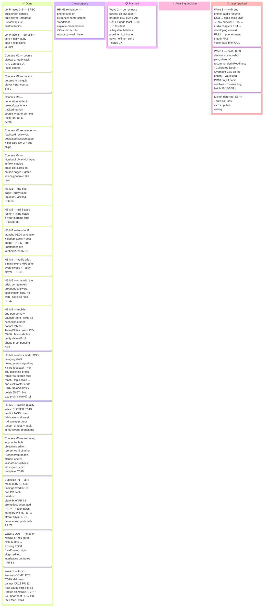

# Master Plan — Home Base

_The **one document** that shows the whole plan and where it stands. The detailed per-phase/
per-milestone plans stay where they are (linked below); this page is the unified progress view
so nobody has to click through a dozen docs to see the state of the project._

> ## 🔄 This is a LIVING document — the maintenance contract
> **Any session that starts, finishes, or reshapes a piece of the plan MUST update this file
> in the same commit/PR as the work**: tick the checkbox, adjust the status column, move the
> card on the Kanban board below, and touch the "Last updated" line. Adding a brand-new
> plan/milestone doc? Add it to the checklist, the board, and the doc map here.
> The rule that enforces this lives in `CLAUDE.md` → "Master plan upkeep".

**Last updated:** 2026-07-19 (ninth entry) · **W1 PR12 — heartbeat dead-man's switch ✅ shipped, WAVE 1 COMPLETE** (PR #85, 5 subprocess tests RED→green against the real script): new `com.homebase.heartbeat` LaunchAgent (09:00 + RunAtLoad — login coverage closes the watcher's own post-reboot blind spot) runs `sweeps/schedule/heartbeat.sh` — newest ledger `ts` (mtime fallback for a mangled row) → **>36h silent** plants `~/Desktop/HOMEBASE-STACK-SILENT.txt` (what to check + kickstart command; auto-removed on recovery) then a macOS notification best-effort; missing ledger alerts, never passes. Deliberately dependency-free (bash + system tools, no venv/node/claude, BSD/GNU fallbacks) so it can't die the pipeline's way. `install-schedule.sh` manages both agents. Backend 519 → **524**. Mac install + live verify: this session, post-merge. **Wave 1 (QU12 · PR5 · QU5 · PR12) done — Wave 2 (correctness sweep) promoted to Planned.** · **W1 QU5 — notes on News/For-You cards ✅ shipped** (PR #84, frontend RED→green + a backend contract pin, zero backend code changes): every News/For-You card gains a Note button + inline composer writing through the *existing* `POST /brief/notes` — `item.id` (sha1-link) as `item_id`, the **origin category slug** as `topic_slug` (For You credits the real section, mirroring `signal()`), local today as `brief_date`, headline snapshot; "✓ Saved" ack; interleaves on `/notes` via the humanized-title fallback; news notes count toward the ≥3 notes/week criterion automatically (`brief_habit_weeks` has no slug filter). Frontend 73 → **76**, backend 518 → **519**. Wave 1 remaining: PR12 heartbeat (local install). · **W1 PR5 — sweep-trust gauge ✅ shipped** (PR #83, regression tests first RED→green): `GET /brief/habit` gains `last_graded` — the newest `## YYYY-MM-DD` heading in the new **`docs/sweep-trust-log.md`** (env `TRUST_LOG`; missing/mangled log → None, never a 500), seeded with the M0 PASS baseline + the ~15-min monthly re-grade recipe on the M0 rubric. The habit strip renders a "Sweep trust:" line — muted while fresh, amber **"re-grade due"** past 30 days, loud "no accuracy grade on record" when the log is empty. No automated grading (assumption-4 gate respected) — the instrument makes neglect visible, the judgment stays Kyle's. Backend 515 → **518**, frontend 70 → **73**. Wave 1 next: QU5 notes-on-News. · **W1 QU12 — didn't-run banner ✅ shipped** (PR #82, regression tests first RED→green): `GET /api/brief` diffs the active (non-paused) roster against the slugs that produced a renderable file for the served day → new `BriefResponse.missing_topics` (roster order/titles; `.raw.txt`-only failures count as missing, fallback-`.md` topics don't — they render error cards; empty when there's no served day) + one warning Banner on Today naming the topics (suppressed offline like the stale hint, tolerant of pre-QU12 SW-cached payloads). Backend suite 510 → **515**, frontend 66 → **70**, typecheck + ruff clean. Wave 1 next: PR5 sweep-trust gauge. · **Backlog roadmap locked — wave order** (prioritization session, docs-only): the 2026-07-19 replenish (21 ideas + 18 low bugs) sequenced into four waves anchored on the ~08-03 v1 check — **W1** trust + liveness + notes funnel (QU12 → PR5 → QU5 → PR12-local; the standing Planned picks, order confirmed) · **W2** correctness sweep (all 18 bug lows + HA2/HA4/HA8/HA11 + FR10 in ~6 test-first subsystem batches) · **W3** walk-and-phone experience (QU3 → QU4 → FR15 → FR4 → FR13 → FR2 → QU1) · **W4** post-check decision points (moonshot pick — Mirror v0 recommended first · vault feed PR10 only if the habit wobbles · courses bug batch #11/#18/#20/#21). Kanban Later column re-cut from per-lane rollups to wave rollups; full order + rationale in the new "Roadmap" section below; `BACKLOG.md ## Open` stays the item-level record. · **Kanban Later column expanded** into per-lane replenish rollup cards (4 Moonshot · 3 QuickWin · 1 Premortem · 4 Harden · 5 Friction · 18 bug lows) so the board shows the pipeline depth — board polish only, no scope change; `BACKLOG.md ## Open` stays the item-level record. · **P1 bug fixes ✅ COMPLETE — all 5 medium 07-19 hunt findings fixed, one PR each, regression test first (RED→green):** **#1 blank-brief wake window** (PR #73 — `latest_sweep_date` skips contentless day dirs; brief/audio/chat all serve the newest renderable day) · **#2 promptless scout add** (PR #74 — the add stamps `prompts/<slug>.md` from the new checked-in `sweeps/prompts/_template.md` before the roster append; fails closed without a template; hand-tuned prompts never overwritten) · **#3 frozen news category** (PR #75 — per-feed error handling in `get_category_items`; healthy feeds serve + cache fresh, stale/502 only when every feed fails) · **#4 UTC streak days** (PR #76 — `activity.day` bucketed on the local calendar across all six raw-SQL writers + the injected-now writers + the `/api/progress` reader; SM-2/attempt timestamps stay UTC; far-TZ test fixture closes the audit's 12:00-UTC blind spot) · **#5 dev-vs-prod port clash** (PR #77 — dev.sh port guard refuses loudly naming `com.homebase.server` with the bootout/reinstall commands). Backend suite 493 → **510 tests**. Next planned: the trust + liveness cluster (QU12 + PR5 + PR12), then QU5 notes-on-News. · **Backlog replenish 2026-07-19 — docs-only:** post-M7 `bug-hunt` fan-out (27 raw → **23 verified findings**, 0 critical / 5 medium — [full report](bug-hunt/2026-07-19-post-m7.md), triage-only, nothing auto-fixed) + a five-lane `/brainstorm` (Moonshot long-leash · QuickWin · Premortem · Harden · Friction; 30 blind lenses → two-sided critic gates → 21 refined survivors, all captured by Kyle) → **21 vision docs in [`docs/ideas/`](ideas/)** + a new **`BACKLOG.md` `## Open` section** (21 idea stubs + 23 bug stubs, the 5 mediums tagged **[P1]** fix-first) + the Planned/Later Kanban refilled below. · **Courses M5 — the authoring loop in the hub: ✅ shipped** ([PHASE7_M5_PLAN](PHASE7_M5_PLAN.md) · PR #69) — **the course epic (M1–M5) is COMPLETE**: `app/courses/writer.py` becomes the ONE transactional write path (the CLI delegates; bundled examples + NotebookLM sidecars stay untouchable), `PUT` objectives + `PUT` order (complete-bijection reorder with fallback-id pinning so `course_lesson_progress` can never re-key), `POST` regenerate on the headless claude lane (per-type output contracts, validate-or-rollback so bad model output can't corrupt a course, `course-regen.jsonl` ledger), `GET` export zip + an `editable` flag, and an edit-mode Course UI (objectives editor · ↑/↓ reorder · Regenerate panel w/ stats-reset warning · Export). 493 backend (+37) & 66 frontend (+4) tests green. · Same-day context: **HB M0 — sweep quality week: ✅ CLOSED, verdict PASS** ([grades + audit](M0-sweep-grades.md)): full week graded (Day-0 audit + Kyle's 07-15 blanket B+ + a source-verified 07-16→18 audit, grades adopted by Kyle 07-19). Zero fabricated items across the week; market/fantasy excellent; AI passed **with a prompt tune** (`sweeps/prompts/ai-llms.md`: exclusion now carries the same sourcing bar as inclusion, after the Gemini-delay story was first missed then falsely dismissed as "low-quality blogs"). The five M0-gate overrides are all retroactively vindicated. · **PR #52 landed** (drafted 07-17): **migration ledger hardening** (`init_db` trusts the store's actual table shape over the `schema_migrations` ledger — re-runs forward migrations idempotently so a poisoned/orphaned ledger row can't silently skip one; poisoned-ledger + unknown-version regression tests) and **habit-metrics instrumentation for the v1 check** (`GET /api/brief/habit` + a self-hiding "Habit check" strip on Today: mornings vs 5 · notes vs 3 per local Monday-start week). · **HB M7 — news mode: ✅ shipped** (`docs/M7_PLAN.md` · PRs #58 RSS shell · #60 signals · #62 For You · #63 topic scout, + post-ship polish **#65** News in the mobile tab bar · **#66** Uplifting category · **#67** headline dedup). · **HB M6 — mobile: ✅ shipped** (`docs/M6_PLAN.md` #54 · PRs #55 + #56). Mac-side live verify clean 2026-07-18 (headless LaunchAgent, one-port serve, audio Range → 206, Tailscale up) and **real-iPhone reach verified 2026-07-18 (PR #64)**: full load over the ts.net HTTPS URL from the phone's tailnet IP, SW registered on the phone, first phone `POST /api/brief/visit` logged. **Remaining M6 evidence — Kyle's eyes-on trio**: home-screen standalone display, airplane-mode "Offline copy" banner, iOS audio scrub (+ reboot survival at next login).

---

## Where we are, in one paragraph

The repo has two arcs. **Arc 1 — Learning Hub** (the original SPEC build order, Phases 1–5,
plus extension Phases 6–7): **fully shipped**, including the SM-2 spaced-repetition core and
the **complete five-milestone Course pipeline** (M1 read+track · M2 quizzes+SM-2 · M3
generation at depth · M4 NotebookLM enrichment · M5 in-hub authoring loop, shipped 2026-07-19
— the epic's last line). **Arc 2 — Home Base** (kickoff 2026-07-13: the
morning-brief evolution): **M1, M2, and M3 are shipped** — M3 (hands-off automation, PR #43)
was built 2026-07-15 under Kyle's third deliberate override of the "wait for the M0 verdict"
gate, and its **first unattended 06:00 fire ran clean on 2026-07-16** (8/8 topics, rc=0,
fresh briefs + ledger rows). The kickoff's phased plan (M0–M3) is fully built, and Kyle
picked the encore on 2026-07-16 — **both halves shipped the same day**: **M4 — the audio
brief** (PR #45: a ~5-minute Kokoro-narrated MP3 rendered after every sweep, 🎧 player on
Today) and **M5 — chat with the brief** (PR #47: "Ask about this" on every brief item — one
grounded answer per question on the subscription lane, no web tools, keepers saved as
notes). **M0's sweep-quality grading week closed 2026-07-19 with a PASS verdict** (zero
fabricated items all week; one prompt tune to the AI sweep) — the Home Base kickoff plan
(M0–M3) plus its four encores (M4–M7) are now fully built *and* fully gated. The open
items are M6's phone-side eyes-on evidence (Kyle) and the ~08-03 v1 success-criteria check.

---

## Kanban

_If the board above doesn't render in your viewer, the checklists below carry the same truth —
the board is a convenience view, the checklists are the record._

---

## Roadmap — replenish wave order (locked 2026-07-19)

_Prioritization session 2026-07-19: the replenish backlog (21 ideas + 18 low bugs) sequenced
into four waves. Organizing principle: everything that protects the ~08-03 v1 criteria
(≥5 mornings/week · events reach Kyle here first · ≥3 notes/week) ships before the check;
the big bets wait for its verdict. Ids are brainstorm-lane ids (QU/PR/HA/FR = QuickWin /
Premortem / Harden / Friction), **not** pull-request numbers; `BACKLOG.md ## Open` stays the
item-level record, with a vision doc per idea in [`ideas/`](ideas/)._

1. **Wave 1 — trust + liveness + notes funnel** — ✅ **COMPLETE 2026-07-19**: QU12 didn't-run
   banner (PR #82) → PR5 sweep-trust gauge (PR #83) → QU5 notes-on-News (PR #84) → PR12
   heartbeat (PR #85; Mac install + live verify same session, evidence in the Last-updated
   entry once recorded).
2. **Wave 2 — correctness sweep**: all 18 bug lows + the 4 hardens + FR10, batched into ~6
   test-first subsystem PRs — sweep/brief pipeline (#7 #22 #19 #6 + HA2 re-sweep warn) ·
   LLM-lane containment (HA4 untrusted framing + #23 tools/cwd + #10 env-scrub set) · news
   resilience (HA8 + #12 + #13) · offline/PWA honesty (#15 #16 #8) · store safety (HA11
   pre-migration snapshot + #9) · notes UX (FR10 undo toast + #14 + #17).
3. **Wave 3 — walk & phone experience**: QU3 audio resume → QU4 topic chips → FR15
   Today-survives-navigation → FR4 audio chapters → FR13 developing "what changed" → FR2
   sweep-from-the-phone → QU1 yesterday's brief. (QU3/FR15/FR4 all touch the audio player —
   the FR15 structural hoist lands before the things that build on it.)
4. **Wave 4 — post-08-03 decision points** (decisions, not commitments — gated on the v1
   check's verdict): the moonshot pick — **Mirror v0 recommended first** (cheapest
   deterministic bet, zero LLM/zero writes, doubles as instrumentation of the very behavior
   the check measures); Readiness Brief / Calibrated Doubt / Overnight Chief of Staff stay
   on the bench (Calibrated needs an M0-style graded week; Overnight needs its own gate
   conversation + the out-of-repo vault bridge; Readiness v0 risks feeling thin without the
   calendar join) · PR10 feed-the-vault **only if** the habit check wobbles (it is the
   antibody for exactly that failure) · courses correctness batch (#11 #18 #20 #21) in one PR.

Waves 1–3 are roughly two weeks at normal cadence, landing at the ~08-03 checkpoint.

---

## Arc 1 — Learning Hub (SPEC build order + extensions) — ✅ COMPLETE

The original product: a NotebookLM learning dashboard (see [`SPEC.md`](../SPEC.md)).
Phases 1–5 were the SPEC build order; 6–7 extended it.

| # | Milestone | Status | Plan doc | Evidence |
|---|-----------|:------:|----------|----------|
| 1 | Catalog + Home + Topic detail (read-only sidecar ingest) | ✅ shipped | [PHASE1_PLAN](PHASE1_PLAN.md) | June 2026 scaffold; parser anti-fabrication guards |
| 2 | In-hub quiz player (offline oracle, answer-key-free sessions) | ✅ shipped | [PHASE2_PLAN](PHASE2_PLAN.md) | `app/quiz/*`, `/api/quiz/*`, QuizPlayer UI |
| 3 | Progress dashboard (trends, streaks, shaky material) | ✅ shipped | [PHASE3_PLAN](PHASE3_PLAN.md) | `store/progress.py`, Progress page w/ inline-SVG sparklines |
| 4 | Mastery decay + "Review next" queue | ✅ shipped | [PHASE4_PLAN](PHASE4_PLAN.md) | `store/mastery.py`, `GET /api/review`, home badges |
| 5 | Custom (non-NotebookLM) topics on home | ✅ shipped | [PHASE5_PLAN](PHASE5_PLAN.md) | `/api/custom-topics` CRUD + "Custom" home section |
| 6 | SM-2 per-item scheduler + daily study plan + reflections journal | ✅ shipped | [PHASE6_PLAN](PHASE6_PLAN.md) | `store/scheduler.py`, `study/planner.py`, `GET /api/study-plan`, Plan page |
| 7 | Courses M1 — course-pipeline vertical slice | ✅ shipped | [PHASE7_PLAN](PHASE7_PLAN.md) | `app/courses/*`, `/api/courses`, Courses UI, `/build-course` |
| 7-M2 | Courses M2 — course quizzes in the player + per-course SM-2 | ✅ shipped | [PHASE7_M2_PLAN](PHASE7_M2_PLAN.md) | `7f2db03`; `course:<slug>` namespace, notebook aggregates filtered |
| 7-M3 | Courses M3 — generation at depth: project/capstone + tracked rubrics · course "what to do next" · skill fan-out at depth | ✅ shipped | [PHASE7_M3_PLAN](PHASE7_M3_PLAN.md) | PR #48; `course_rubric_assessment` (schema v6) · `GET /courses/{slug}/next` · `POST /courses/{slug}/assess` · rubric self-assessment UI |
| 7-M4 | Courses M4 — NotebookLM enrichment in-flow: catalog cross-link on course pages + gated skill flow | ✅ shipped | [PHASE7_M4_PLAN](PHASE7_M4_PLAN.md) | PR #50; `CourseMaterial.notebook` join via `_attach_notebook_refs` · Open-notebook card w/ counts + calm degrades · course-builder §5 two-path flow · **live proof verified 2026-07-16**: `jlens-global-workspace` course (syllabus-gated `/build-course`, `ok:true` zero warnings) links notebook `f84dc873…` via the no-quota path; card resolves against the real catalog |
| 7-M5 | Courses M5 — the authoring loop in the hub: edit objectives · reorder · regenerate · export (the epic's last line) | ✅ shipped | [PHASE7_M5_PLAN](PHASE7_M5_PLAN.md) | PR #69; `courses/writer.py` = the one transactional write path (CLI delegates; write→validate→byte-identical rollback; bundled examples 409/`editable:false`) · `PUT …/objectives` + `PUT …/order` (complete bijection, `pin_ids` oracle-tested against the loader) · `POST …/regenerate` on the chat.py lane (key scrubbed, no tools, per-type contracts, `course-regen.jsonl`) · `GET …/export` zip · edit-mode UI w/ stats-reset warning · 493 backend + 66 frontend tests |

Also closed in this arc: the **bug-hunt audit** — all 11 low-severity findings resolved
(PRs #21–#31, [`docs/bug-hunt/`](bug-hunt/)).

**Open remainder from the course epic's M2 spec** — ✅ closed 2026-07-16:
- [x] Flashcard **review UI** — ✅ shipped 2026-07-16, PR #49: a dedicated review session at
      `/courses/:slug/flashcards` (due → new → later ordering, again/hard/good grades advancing
      per-card SM-2 in the shared store under `course:<slug>` — no schema change), Review CTAs +
      due chips on Course detail, and due decks ranked into the course "what to do next".
      Addendum in [PHASE7_M2_PLAN](PHASE7_M2_PLAN.md)

---

## Arc 2 — Home Base (morning brief) — 🔄 IN FLIGHT

The current arc: evolve the hub into Kyle's daily home base — self-updating morning brief +
inline notes, learning riding along. Contract: [`KICKOFF-home-base.md`](KICKOFF-home-base.md).

- [x] **M0 — Sweep quality week** — ✅ **CLOSED 2026-07-19, verdict PASS** ([grades + audit](M0-sweep-grades.md))
  - [x] Sweep engine: per-topic prompts + `make sweep` runner (PR #34)
  - [x] Day-0 source-verified audit: AI **A−** · fantasy **A** · market **A** (PR #35)
  - [x] JSON pipeline refit: prompts emit strict JSON → validated render (with M1, PR #36)
  - [x] First full-roster 8-topic production sweep verified clean, incl. cloud-session run (2026-07-15, PR #40)
  - [x] Daily A–F grades through 07-18: Kyle's 07-15 blanket B+ · source-verified 07-16→18 audit (~30 cross-searches, zero fabrications), grades adopted by Kyle 07-19
  - [x] **Go/no-go verdict — PASS, 2026-07-19**: market outstanding · fantasy strong · AI passes **with a prompt tune** (`sweeps/prompts/ai-llms.md`: exclusion carries the same sourcing bar as inclusion, after the mishandled Gemini-delay thread). Kill criteria not met.
- [x] **M1 — The brief page** — ✅ shipped 2026-07-13, PR #36 ([plan](M1_PLAN.md); deliberate Day-0 override of the M0 gate)
      _Today route at `/` renders stored sweeps · `GET /api/brief` · visit log (habit metric) · old home → "Learning" tab_
- [x] **M2 — Full roster + notes** — ✅ shipped 2026-07-14, PRs #38 + #39 ([plan](M2_PLAN.md); second deliberate override)
      _`sweeps/topics.json` roster (8 topics, pause flags) · read-time item ids · inline notes (`brief_notes` v5, `/notes` page) · "Your learning" strip_
- [x] **M3 — Hands-off** — ✅ shipped 2026-07-15, PR #43 ([plan](M3_PLAN.md); built under the third deliberate override of the M0-verdict gate)
  - [x] Launchd scheduler + wrapper + installer; on-wake catch-up; auth spike + a bounded launchd run proven end-to-end
  - [x] Cost/usage guardrails: `--output-format json` → `data/sweeps/.runs.jsonl` ledger · API-key guard · skip-done · max-topics
  - [x] Read-time dedup: `developing`/`first_seen` labels on repeated stories (nothing dropped) + subtle Today chip
  - [x] Schedule installed 2026-07-15 at 06:00 CT; **first unattended fire verified 2026-07-16** — 8/8 topics, `rc=0` in 25½ min, fresh briefs + 8 ledger rows (~$10 equiv/day, subscription lane — not billed)
- [x] **M4 — Audio brief** — ✅ shipped 2026-07-16, PR #45 ([plan](M4_PLAN.md); picked same day from the post-M3 menu — audio-first over one combined milestone)
      _`sweeps/audio_brief.py`: deterministic ~650-word ear script → local Kokoro (`com.voicemode.kokoro`) → `data/sweeps/<date>/brief.mp3`, best-effort after every sweep (never fails it) · `GET /api/brief/audio` + `audio_available` · 🎧 player on Today · first real render 4:49 across 8 topics_
- [x] **M5 — Chat with the brief** — ✅ shipped 2026-07-16, PR #47 ([plan](M5_PLAN.md); approach A from its own explore-plan — per-item Ask, no web tools)
      _`app/chat.py` (headless `claude -p` on the subscription lane, API key scrubbed, no tools) · `POST /api/brief/chat` · "Ask about this" on every item with save-as-note reuse · `brief-chat.jsonl` ledger under backend data · live e2e: grounded answer in 13s, ~$0.07 equiv_
- [x] **M6 — Mobile** — ✅ shipped 2026-07-18, PRs #55 + #56 ([plan](M6_PLAN.md); promoted from the kickoff-deferred list, the M4/M5 path; fourth deliberate override of the M0-verdict gate — zero new prompt surface)
      _One-port serving backbone (FastAPI serves `frontend/dist`, `/api` always wins) + `com.homebase.server` KeepAlive LaunchAgent (printed pmset, never sudo) · sw.js v2 cached-last-brief offline w/ `X-Served-From-Cache` honesty (writes never queue) · bottom tab bar &lt;sm + Today/Notes phone pass (desktop untouched) · Mac-side live verify clean 2026-07-18 incl. audio Range 206 · **real-iPhone reach verified 2026-07-18 (PR #64)** — ts.net load from the phone's tailnet IP, SW registered, first phone visit logged · remaining: Kyle's eyes-on trio (home-screen standalone · airplane-mode banner · iOS audio scrub) + reboot survival_

- [x] **M7 — News mode** — ✅ shipped 2026-07-18, all four phases: PRs #58 · #60 · #62 · #63 ([plan](M7_PLAN.md); approved by Kyle from a recon-backed interview — RSS sourcing · Local = Chicago/Lake Co. · behavior-only For You signals; fifth deliberate M0-gate override, zero new LLM surface)
  - [x] Phase 1 — RSS shell: `sweeps/news_categories.json` roster · `app/news.py` (stdlib fetch/parse, sha1-link ids) · `news_feed_cache` (schema v7, 15-min TTL, stale-honesty) · `GET /api/news/*` · `/news` page w/ category tabs + text-first cards · 13 backend + 5 page tests
  - [x] Phase 2 — signals ✅ 2026-07-18: `news_events` (schema v8, snapshot columns) + `POST /api/news/events` (invalid events 400) + visit/click logging + More-like-this / Not-interested card buttons, all fire-and-forget
  - [x] Phase 3 — For You ✅ 2026-07-18: `app/foryou.py` decaying profile (click +3 · more_like +5 · not_interested −8 · visit +1, 14-day half-life) → all sections + per-term search RSS candidates → interest × freshness ranking w/ seen-exclusion, negative-drop, headline dedup · `GET /api/news/foryou` · default For You tab w/ origin chips + honest cold start
  - [x] Phase 4 — topic scout ✅ 2026-07-18: `suggest_topics` (score ≥ 9 across ≥ 3 days · event-level roster coverage · token-disjoint one-card-per-theme · theme-wide dismiss memory, schema v9) → evidence cards in For You → `POST /api/news/suggestions/add` appends atomically to `sweeps/topics.json` (409 on dupe; the one deliberate Mode-B → Mode-A write) · live e2e proof clean
  - [x] Post-ship polish ✅ 2026-07-18: **PR #65** News promoted into the mobile bottom tab bar · **PR #66** Uplifting category (good-news feeds + attribution fallback) · **PR #67** near-duplicate headline collapse on category pages (newest copy wins)

**v1 success criteria to check ~3 weeks in** (from the kickoff): ≥5 mornings/week habit (visit
log) · significant events reach Kyle here first · foraging → ~zero · ≥3 notes/week attach.
_Instrumented 2026-07-17 (PR #52): `GET /api/brief/habit` + a self-hiding "Habit check" strip on
Today count mornings + notes per local Monday-start week — the two measurable criteria read at a
glance instead of a sqlite dig._

---

## Parked / deferred (not scheduled — do not build without a decision)

- **Kickoff-deferred v1 outs**: ESPN league integration · auto-courses from news items ·
  breaking-news alerts · public writing. _(The audio brief became M4 and chat-with-the-brief
  became M5 on 2026-07-16; mobile access became M6 on 2026-07-18.)_
- **BACKLOG parked ideas** ([BACKLOG.md](../BACKLOG.md)): study-planner subagent (superseded by
  Phase 6), learner-profile doc, "Generate from hub" button, hosted phone access (M6's
  Tailscale retires the same-LAN half; the Mac-must-be-running half stays parked).

---

## Doc map (the detailed plans this page summarizes)

| Doc | What it holds |
|---|---|
| [`SPEC.md`](../SPEC.md) | Arc-1 product spec (Learning Hub) |
| [`KICKOFF-home-base.md`](KICKOFF-home-base.md) | Arc-2 contract: brief, scope, risks, milestones |
| [`PHASE1..7_PLAN.md`, `PHASE7_M2..M5_PLAN.md`](.) | Per-phase build plans (Arc 1) |
| [`COURSE_PIPELINE_SPEC.md`](COURSE_PIPELINE_SPEC.md) | Course epic vision + M1–M5 roadmap |
| [`M1_PLAN.md`](M1_PLAN.md) … [`M7_PLAN.md`](M7_PLAN.md) | Home Base milestone plans (record decided design forks — don't relitigate) |
| [`M0-sweep-grades.md`](M0-sweep-grades.md) | The grading week's durable evidence + running verdict |
| [`sweep-trust-log.md`](sweep-trust-log.md) | PR5 trust gauge: the monthly accuracy re-grade log (`last_graded` reads its newest dated heading) |
| [`bug-hunt/2026-07-19-post-m7.md`](bug-hunt/2026-07-19-post-m7.md) | Post-M7 verified bug audit — 23 findings, ranked, triage-only |
| [`ideas/`](ideas/) | Vision docs for captured brainstorm ideas (replenish 2026-07-19) |
| [`../BACKLOG.md`](../BACKLOG.md) | Parking lot for uncommitted ideas + the replenished `## Open` queue |
